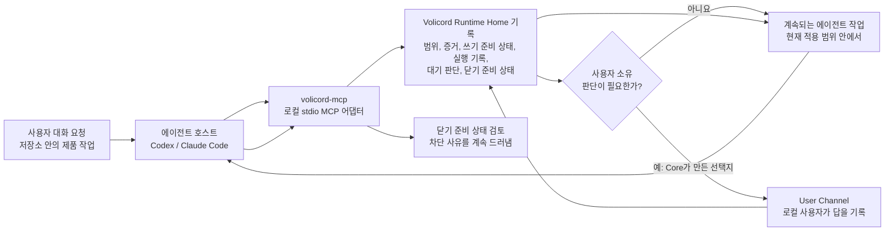
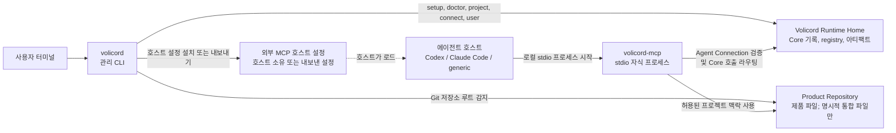

# Volicord(볼리코드)

AI가 움직여도, 판단은 사용자에게.

Volicord는 AI 지원 제품 작업을 위한 로컬 작업 권한 시스템입니다. 사용자가
에이전트 호스트에게 제품 저장소 변경을 요청했을 때 작업의 중요한 기록이 대화,
셸 출력, 호스트 설정, 임시 메모, 기억에 흩어지지 않도록 하기 위해 존재합니다.

Volicord는 범위, 증거, 쓰기 준비 상태, 실행 기록, 대기 중인 사용자 판단, 닫기
준비 상태에 대한 지속 로컬 기록을 유지합니다. Core는 Volicord 상태를 위한 로컬
기준 기록입니다. 대화 메시지, 생성된 Markdown, 상태 요약, 상태 보기는 Core
상태를 설명할 수 있지만 대신하지는 않습니다.

## 빠른 시작

로컬 바이너리를 빌드하고, 설치 프로필을 준비하고, 제품 저장소로 이동한 뒤 Codex를
연결합니다.

```sh
cargo build --workspace --bins
./target/debug/volicord setup --link-bin ~/.local/bin
cd /work/acme-api
volicord connect codex
```

이 흐름은 선택된 `Volicord Runtime Home`을 준비하고, 이후 흐름이 사용할
`volicord`와 `volicord-mcp` 명령 위치를 저장하며, 현재 디렉터리에서 Git 저장소
루트를 감지하고, 그 저장소 프로젝트를 등록하거나 재사용하고, 일치하는
`Agent Connection`을 위한 지원 Codex 호스트 설정을 설치합니다.

로컬 설정과 연결을 확인합니다.

```sh
volicord doctor
volicord project current
volicord connection status codex
volicord connection verify codex
```

`--link-bin`으로 setup한 뒤 셸이 `volicord`를 찾지 못하면 그 링크 디렉터리를 셸
설정에 추가하고 새 셸이나 MCP 호스트를 시작합니다. 명령이 `action_required`를
보고하면 이름 붙은 호스트 소유 trust, approval, reload, restart, setup repair
동작을 완료한 뒤 관련 status 또는 verification 명령을 다시 실행합니다.

정확한 setup 동작, 연결 기본값, 옵션 의미, 출력 동작은
[관리 CLI 참조](docs/ko/reference/admin-cli.md)가 담당합니다.

## 사용자 요청의 실제 흐름

`/work/acme-api`에서 Codex에게 "결제 생성에 idempotency key 지원을 추가하고,
테스트를 갱신한 뒤 닫을 준비가 되었을 때 알려 줘"라고 요청한다고 생각해 봅니다.
Codex는 계속 에이전트 호스트입니다. Volicord는 에디터, 셸, 테스트 실행기, 대화를
대체하지 않습니다. 대신 호스트가 지속 작업 기록이 필요할 때 MCP를 통해 Volicord에
닿게 합니다.

에이전트 호스트는 관리 호스트 설정에서 로컬 `volicord-mcp` stdio 어댑터를
시작합니다. 어댑터는 선택된 `Agent Connection`을 검증하고, 허용된 저장소 프로젝트
맥락을 사용하며, 도구 호출을 `Volicord Runtime Home` 안의 Core 기록으로 전달합니다.

작업에 제품 결정, 범위 변경, 민감 단계, 최종 수락, 잔여 위험 수락, 취소가 필요하면
에이전트는 초점이 맞춰진 판단을 요청할 수 있습니다. 하지만 답을 만들어 내거나 사용자를
대신해 권한을 지니는 답을 기록할 수는 없습니다. 답은 예를 들어 `volicord user ...` 같은
로컬 `User Channel`을 통해 기록되고, 그 뒤 에이전트는 갱신된 Core 상태에서 계속 작업할
수 있습니다.

## 사용자 작업 흐름

그림 역할: 사용자 작업 흐름입니다. 이 그림은 처음 읽는 사용자의 "Volicord가 작업을
기록하고 내 판단을 요청할 때 내 대화 요청은 어디로 가는가?"라는 질문에 답합니다.
화살표는 가이드 수준의 대화 전달과 Core 상태 갱신을 뜻하며, 전체 API 호출 순서,
저장소 배치, 구성 요소 경계 지도는 아닙니다. 정확한 Core 권한 개념, MCP 전송 동작,
런타임 경계는 [Core 모델](docs/ko/reference/core-model.md),
[MCP 전송](docs/ko/reference/mcp-transport.md),
[런타임 경계](docs/ko/reference/runtime-boundaries.md) 참조가 담당합니다.



닫기 준비 상태는 현재 `Task`를 닫을 때 해결되지 않은 Volicord 요구사항을 숨기지
않아도 되는지를 묻습니다. 이는 판단을 돕는 기록이지, 제품 결과가 객관적으로
옳다거나, 테스트가 충분하다거나, 위험이 사라졌다는 증명이 아닙니다.

## 로컬 구성 요소 지도

그림 역할: 구성 요소 지도입니다. 운영자의 "어떤 로컬 프로세스, 기록, 호스트 소유
설정, 저장소 경계가 관여하는가?"라는 질문에 답합니다. 화살표는 로컬 실행, 설정
로드, Core 기록 접근, 저장소 맥락 사용을 뜻하며, 사용자 대화 흐름이나 모든 저장
효과를 보여 주지는 않습니다. 정확한 명령, MCP, Agent Connection, 런타임 경계
동작은 [관리 CLI](docs/ko/reference/admin-cli.md),
[MCP 전송](docs/ko/reference/mcp-transport.md),
[Agent Connection](docs/ko/reference/agent-connection.md),
[런타임 경계](docs/ko/reference/runtime-boundaries.md) 참조가 담당합니다.



`Volicord Runtime Home`은 `Product Repository`와 분리됩니다. Volicord 런타임 기록,
SQLite 파일, 생성 기록, 로그, QA 결과, 수락 기록, 닫기 준비 상태, 잔여 위험
기록은 제품 파일 안에 두지 않습니다. `Product Repository`에는 프로젝트 범위 호스트
설정이나 관리 지침처럼 지원되는 setup 흐름이 담당하는 명시적 통합 파일만 들어갈 수
있습니다.

## Volicord가 관리하는 것

Volicord가 관리하는 것:

- 로컬 설치 프로필과 Runtime Home 준비 상태
- 저장소 루트 기반 프로젝트 등록과 로컬 작업을 위한 프로젝트 선택
- `Agent Connection` 기록, Connection Projects 멤버십, 지원되는 호스트 설정 또는
  MCP 설정 내보내기
- 범위, 증거, `Write Check` 호환성, 실행 기록, 대기 중인 사용자 판단, 차단 사유,
  닫기 준비 상태에 대한 Core 기록
- 권한을 지니는 사용자 판단을 기록하는 로컬 `User Channel` 경로

Volicord가 관리하지 않는 것:

- 제품 정확성, 테스트 충분성, QA 완료, 배포 성공, 위험이 없는 결과
- OS 권한, 셸 권한, 네트워크 접근, 샌드박싱, 비밀값 격리, 호스트 신뢰
- 제품 판단, 기술 판단, 범위 판단, 민감 동작 판단, 최종 수락, 잔여 위험 수락,
  취소에 대한 사용자 자신의 결정 자체
- 현재 에이전트, 호스트, 에디터, 셸, 저장소 작업 흐름 밖의 일반 제품 파일 편집
- 외부 MCP 호스트의 로드, trust, approval, reload, restart, OAuth 동작

## 다음에 볼 문서

| 필요 | 읽을 문서 |
|---|---|
| 실행 파일 설치와 확인 | [설치](docs/ko/getting-started/installation.md), 그다음 [Quickstart](docs/ko/getting-started/quickstart.md) |
| 사용자 작업 흐름 이해 | [사용자 가이드](docs/ko/guides/user-workflow.md) |
| 에이전트 호스트 설정 또는 복구 | [에이전트 호스트 Setup](docs/ko/guides/agent-host-setup.md)과 [에이전트 호스트 문제 해결](docs/ko/guides/agent-host-troubleshooting.md) |
| 에이전트 동작 경계 이해 | [에이전트 가이드](docs/ko/guides/agent-workflow.md) |
| 정확한 CLI, MCP, 런타임 계약 확인 | [관리 CLI 참조](docs/ko/reference/admin-cli.md), [MCP 전송](docs/ko/reference/mcp-transport.md), [런타임 경계](docs/ko/reference/runtime-boundaries.md) |
| Core 권한 개념 이해 | [Core 모델](docs/ko/reference/core-model.md) |
| 구현 학습 | [코드베이스 둘러보기](docs/ko/development/codebase-tour.md) |

Volicord 명령은 로컬 관리 명령이며 공개 Volicord API 메서드가 아닙니다. 정확한 공개
API 동작은 [참조 색인](docs/ko/reference/README.md)이 담당합니다.
