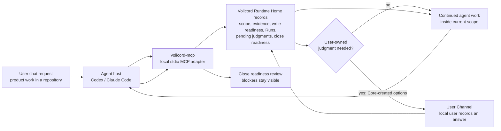
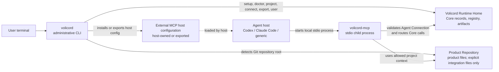

# Volicord

AI moves. Judgment stays yours.

Volicord is a local work-authority system for AI-assisted product work. It
exists for the moment when a user asks an agent host to change a product
repository and the important record of the work would otherwise be scattered
across chat, shell output, host configuration, ad hoc notes, and memory.

Volicord keeps a durable local trail for scope, evidence, write readiness, Run
records, pending user judgments, and close readiness. Core is the local
authority record for Volicord state; chat messages, generated Markdown, status
summaries, and projections can describe that state, but they do not replace it.

## Quick Start

Build the local binaries, prepare the installation profile, move into a product
repository, and connect Codex:

```sh
cargo build --workspace --bins
./target/debug/volicord setup --link-bin ~/.local/bin
cd /work/acme-api
volicord connect codex
```

That flow prepares the selected `Volicord Runtime Home`, stores the `volicord`
and `volicord-mcp` command locations used by later flows, detects the Git
repository root from the current directory, registers or reuses that repository
project, and installs the supported Codex host configuration for the matching
`Agent Connection`.

Check the local setup and connection:

```sh
volicord doctor
volicord project current
volicord connection status codex
volicord connection verify codex
```

If your shell cannot find `volicord` after setup with `--link-bin`, add that
link directory to your shell configuration and start a new shell or MCP host.
If a command reports `action_required`, complete the named host-owned trust,
approval, reload, restart, or setup repair action, then rerun the relevant
status or verification command.

Exact setup behavior, connection defaults, option semantics, and output
behavior belong to the
[Administrative CLI Reference](docs/en/reference/admin-cli.md).

## A User Request In Practice

Imagine you are in `/work/acme-api` and ask Codex: "Add idempotency-key support
for payment creation, update the tests, and tell me when it is ready to close."
Codex remains your agent host. Volicord does not replace the editor, shell, test
runner, or chat. Instead, the host reaches Volicord through MCP when it needs a
durable work record.

The agent host starts the local `volicord-mcp` stdio adapter from its managed
host configuration. The adapter validates the selected `Agent Connection`, uses
the allowed repository project context, and routes tool calls to Core records in
the `Volicord Runtime Home`.

If the work needs a product decision, scope change, sensitive step, final
acceptance, residual-risk acceptance, or cancellation, the agent can request a
focused judgment. It cannot invent the answer or record an authority-bearing
answer for you. The answer is recorded through the local `User Channel`, for
example with `volicord user ...`, and then the agent can continue from the
updated Core state.

## User Workflow

Diagram role: user workflow. It answers the first-user question, "where does my
chat request go when Volicord records work and asks for my judgment?" Arrows
show conversational handoffs and Core-state updates at guide level; they are
not a complete API call sequence, storage layout, or component boundary map.
Exact Core authority concepts, MCP transport behavior, and runtime boundaries
belong to the [Core Model](docs/en/reference/core-model.md),
[MCP Transport](docs/en/reference/mcp-transport.md), and
[Runtime Boundaries](docs/en/reference/runtime-boundaries.md) references.



Close readiness asks whether the current `Task` can close without hiding
unresolved Volicord requirements. It is decision support, not proof that the
product result is objectively correct, that tests are sufficient, or that risk
has disappeared.

## Local Component Map

Diagram role: component map. It answers the operator question, "which local
processes, records, host-owned configuration, and repository boundary are
involved?" Arrows show local launches, configuration loading, Core-record
access, and repository-context use; they do not show the user chat workflow or
every storage effect. Exact command, MCP, Agent Connection, and runtime-boundary
behavior belongs to the [Administrative CLI](docs/en/reference/admin-cli.md),
[MCP Transport](docs/en/reference/mcp-transport.md),
[Agent Connection](docs/en/reference/agent-connection.md), and
[Runtime Boundaries](docs/en/reference/runtime-boundaries.md) references.



`Volicord Runtime Home` is separate from the `Product Repository`. Volicord
runtime records, SQLite files, generated records, logs, QA results, acceptance
records, close-readiness state, and residual-risk records do not belong in your
product files. A `Product Repository` may contain only explicit integration
files owned by supported setup flows, such as project-scoped host configuration
or managed guidance.

## What Volicord Manages

Volicord manages:

- local installation profile and Runtime Home readiness
- repository-root project registration and project selection for local work
- `Agent Connection` records, Connection Projects membership, and supported
  host configuration or MCP config export
- Core records for scope, evidence, `Write Check` compatibility, Run records,
  pending user judgments, blockers, and close readiness
- the local `User Channel` path for recording authority-bearing user judgments

Volicord does not manage:

- product correctness, test sufficiency, QA completion, deployment success, or
  risk-free outcomes
- OS permissions, shell permission, network access, sandboxing, secret
  isolation, or host trust
- the user's own product, technical, scope, sensitive-action, final-acceptance,
  residual-risk, or cancellation decisions
- ordinary product-file editing outside the current agent, host, editor, shell,
  and repository workflow
- external MCP host loading, trust, approval, reload, restart, or OAuth actions

## Where To Go Next

| Need | Read |
|---|---|
| Install and verify executables | [Installation](docs/en/getting-started/installation.md), then [Quickstart](docs/en/getting-started/quickstart.md) |
| Understand the user work loop | [User Guide](docs/en/guides/user-workflow.md) |
| Set up or repair an agent host | [Agent Host Setup](docs/en/guides/agent-host-setup.md) and [Agent Host Troubleshooting](docs/en/guides/agent-host-troubleshooting.md) |
| Understand agent behavior boundaries | [Agent Guide](docs/en/guides/agent-workflow.md) |
| Check exact CLI, MCP, and runtime contracts | [Administrative CLI Reference](docs/en/reference/admin-cli.md), [MCP Transport](docs/en/reference/mcp-transport.md), and [Runtime Boundaries](docs/en/reference/runtime-boundaries.md) |
| Understand Core authority concepts | [Core Model](docs/en/reference/core-model.md) |
| Learn the implementation | [Codebase Tour](docs/en/development/codebase-tour.md) |

Volicord commands are local administrative commands, not public Volicord API
methods. Exact public API behavior is owned by the
[Reference Index](docs/en/reference/README.md).
