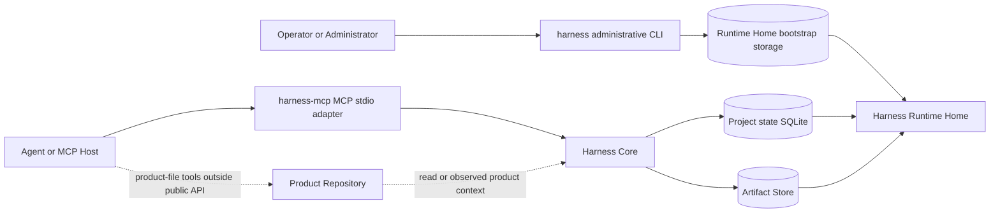

# Implementation architecture

This guide gives implementers a durable repository-architecture reading path for the local Rust implementation. It describes layer separation, crate placement, and owner-routing support only.

It does not define or override public API behavior, request or response fields, schema meaning, storage effects, DDL or table columns, security guarantees, runtime enforcement, Core authority semantics, or product contracts. For those questions, follow the [Implementation Guide](implementation-guide.md) and the applicable Reference owner.

Harness is the local work-authority product/system for AI-assisted product work. Core is the local authority record for Harness state.

## Owner Boundary

| This guide may describe | This guide routes away |
|---|---|
| Guide-level implementation architecture. | API method behavior and supported public methods. |
| Guide-level layer separation among adapters, Core, stores, runtime data, and product files. | Request fields, response fields, shared schemas, and value meanings. |
| A conservative Rust workspace shape for implementers. | Storage record layout, storage effects, artifact lifecycle detail, and DDL. |
| Reading support for locating the focused owner. | Security guarantee wording, access-boundary claims, Core authority semantics, and product contracts. |

## Layer Model

Read the solid paths as two distinct current implementation paths. An agent or MCP host starts `harness-mcp`, reaches Harness Core through the MCP stdio adapter, and Core uses project-state and artifact storage under `Harness Runtime Home`. An operator or administrator uses the `harness` administrative CLI for Runtime Home, project, and surface bootstrap storage; that path is not a public Harness workflow-method adapter and does not imply that the CLI invokes public Core method services. Read the dotted paths as boundary reminders: `Product Repository` is a separate product-file boundary that Core may read or observe through owner-defined inputs, while actual product-file tools run outside the public Harness API.

The diagram is an implementation guide. It is not a storage layout, a security boundary, a method contract, or proof that any runtime exists.

## Layer Responsibilities

| Layer | Guide-level responsibility | Does not own |
|---|---|---|
| Agent or MCP Host | Starts or communicates with a supported MCP adapter and may use product-file tools outside the public API path. | Core authority, storage authority, security guarantees, or product-file authority. |
| MCP Adapter | Translates MCP stdio transport into Core-facing calls and returns owner-shaped results. | Core meaning, method behavior, schema meaning, or storage effects. |
| Administrative CLI | Initializes and registers local Runtime Home, project, and surface bootstrap records. | Public Harness workflow methods, Core meaning, method behavior, schema meaning, or storage effects. |
| Harness Core | Evaluates owner-defined authority decisions and coordinates storage-facing interfaces. | Adapter transport, DDL, artifact byte lifecycle, or security guarantee wording. |
| SQLite Store | Implements the record store behind Core according to storage owners. | API behavior, Core semantics, or table detail in this guide. |
| Artifact Store | Implements staged and persistent artifact storage support according to artifact owners. | Artifact lifecycle contracts or schema fields in this guide. |
| `Harness Runtime Home` | Holds Harness runtime data as runtime and storage owners define. | `Product Repository`, server installation storage by default, or a security boundary by itself. |
| `Product Repository` | Holds the user's product files that may be read, observed, or changed outside the public API path. | Harness runtime state, Core records, artifact authority, or `Harness Runtime Home`. |

Core owns authority decisions defined by the Reference owners. The MCP adapter translates public-method transport only. The administrative CLI performs local bootstrap and registration work only. Core-facing code must stay independent of CLI and MCP adapter layers; the MCP adapter may depend on Core-facing interfaces.

At guide level, MCP adapter startup selects one project, one surface, and one surface instance for a session, then derives requested access per public method call from the method and typed params. Exact session binding, access derivation, and grant rules stay with [Agent Integration](../reference/agent-integration.md) and the method owners.

## Rust Workspace Shape

For Rust implementation work, keep the baseline workspace narrow and layered:

| Crate | Guide-level contents |
|---|---|
| `crates/harness-types` | Shared Rust types, identifiers, result enums, and serialization helpers that mirror owner-defined schemas without becoming the schema owner. |
| `crates/harness-store` | SQLite-backed record-store interfaces, artifact-store plumbing, migrations, and storage test helpers routed to storage owners. |
| `crates/harness-core` | Core-facing services that apply owner-defined transitions, authority checks, idempotency calls, and store coordination. |
| `crates/harness-cli` | Local administrative/bootstrap commands for Runtime Home initialization, project registration, and surface registration. |
| `crates/harness-mcp` | MCP stdio adapter that maps public Harness tools to Core-facing services and returns owner-shaped responses. |
| `crates/harness-test-support` | Test fixtures, disposable runtime-home helpers, and shared assertions for implementation tests. |

Crate names and module boundaries are implementation placement guidance. Public method names, schemas, storage effects, and value meanings still come from the Reference owners.

## Runtime Home And Product Repository

`Harness Runtime Home` and `Product Repository` are separate boundaries. The runtime home is where Harness-owned records, metadata, and artifact data belong when the storage and runtime owners define them. The product repository is the user's product-file workspace.

The two locations may be near each other on a local filesystem, but location does not collapse their meanings. A product file is not a Core record merely because Core observed it. A runtime record is not a product file merely because it refers to a product path. Direct local changes outside documented Harness contracts do not create valid Core records, evidence, acceptance, residual-risk acceptance, `Write Authorization`, or artifact authority.

The public Harness API does not directly edit product files. A connected surface or local tool may perform product-file writes outside the public API path; Harness records write compatibility and observed results through owner-defined API flows.

## Write Preparation And Run Recording

At guide level, read the write path this way:

1. `harness.prepare_write` asks Core to evaluate whether one intended product-file write attempt is compatible with current owner-defined state. When the method owner allows it, Core creates a `Write Authorization` authority record.
2. Any actual product-file edit happens outside the public Harness API, through the connected surface or local tooling. This guide does not define the file-write mechanism and does not make a security guarantee.
3. `harness.record_run` records observed work after the fact and may update the current close basis or record owner-supported evidence, blockers, artifact links, or artifact promotion. A Run record does not retrofit missing authority or prove a write occurred beyond owner-defined recorded facts. Terminal close behavior stays with `harness.close_task`.

Use the method owners for exact behavior. Use storage owners for persistence effects. Use Core Model for authority meaning.

## Owner Routes

| Implementation question | Owner route |
|---|---|
| Core authority concepts, `Write Authorization`, user-owned judgment, evidence, acceptance, and residual-risk boundaries | [Core Model](../reference/core-model.md) |
| `Product Repository`, `Harness Runtime Home`, `Harness Server`, and runtime location separation | [Runtime Boundaries](../reference/runtime-boundaries.md) |
| `harness` administrative/bootstrap CLI behavior | [Administrative CLI](../reference/admin-cli.md) |
| `harness-mcp` MCP stdio process behavior | [MCP Transport](../reference/mcp-transport.md) |
| Supported public methods and method-specific behavior | [API Methods](../reference/api/methods.md), then the method owner |
| `harness.prepare_write` behavior | [`harness.prepare_write`](../reference/api/method-prepare-write.md) |
| `harness.record_run` behavior | [`harness.record_run`](../reference/api/method-record-run.md) |
| `harness.close_task` behavior | [`harness.close_task`](../reference/api/method-close-task.md) |
| Storage owner reading order | [Storage](../reference/storage.md) |
| Storage effects | [Storage Effects](../reference/storage-effects.md) |
| Record layout | [Storage Records](../reference/storage-records.md) |
| Artifact storage lifecycle | [Artifact Storage](../reference/storage-artifacts.md) |
| Versioning, replay, locking, and migrations | [Storage Versioning](../reference/storage-versioning.md) |
| Surface and connector boundaries | [Agent Integration](../reference/agent-integration.md) |
| Security guarantees and non-claims | [Security](../reference/security.md) |

Use this page to place code and keep boundaries visible. Use the focused owners to decide behavior.
