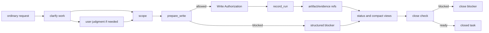

# Build: Runtime Walkthrough

## What this document helps you do

Use this page as a design walkthrough of intended Harness runtime behavior. It helps implementers see how one request should move from ordinary user language to scope, write authority, evidence, status, and close outcome.

This page is not evidence that runtime exists. It does not authorize server/runtime implementation, generated operational artifacts, executable fixtures, runtime data, or new schemas before the handoff gates in [Implementation Overview](implementation-overview.md#documentation-acceptance-status) are accepted.

## Read this when

- You want the request-to-close mental model before reading every Reference contract.
- You are checking whether a proposed implementation path keeps state, artifacts, projections, and blockers distinct.
- You need to see which parts belong to Engineering Checkpoint and which parts belong to MVP-1 or later.

## Main idea

Harness runtime behavior should preserve local authority through Core-owned state and artifact refs. Chat text, generated Markdown, connector output, and projection views can help people read the work, but they do not become authority.

Engineering Checkpoint implements only the internal middle of this path: project, Task, scope, `prepare_write`, single-use Write Authorization, `record_run`, one artifact/evidence ref, and status/blocker output.

MVP-1 adds user-visible behavior around that loop: ordinary-language start/resume, work-shape classification, scope/non-goals/success criteria, minimal user judgment, evidence summary, close blockers, next safe action, residual-risk visibility, and separate approval/acceptance/risk displays.

## Intended path at a glance

This diagram is a reader aid. Exact state transitions, schemas, DDL, errors, and projection rules stay in the Reference owners.

## Step-by-step design path

### 1. Request -> Task

The user describes work in ordinary language. MVP-1 should decide whether to start or resume tracked work and classify the work shape. Engineering Checkpoint may use an owner-valid setup or seed path instead of natural-language intake.

Owner docs: [Core Model Reference](../reference/core-model.md), [MVP API](../reference/api/mvp-api.md), [Storage](../reference/storage.md).

### 2. Task -> clarification

When the request is ambiguous, risky, product-facing, or likely to need user judgment, Harness clarifies the goal, non-goals, success criteria, inspectable facts, assumptions, and likely judgment boundaries. This is shaping input; it is not evidence, Approval, Write Authorization, work acceptance, residual-risk acceptance, or close.

Owner docs: [Core Model Reference: User Judgment](../reference/core-model.md#user-judgment), [`harness.request_user_judgment`](../reference/api/mvp-api.md#harnessrequest_user_judgment).

### 3. Clarification -> scope

The next safe work boundary becomes scope for product changes. Scope says what may change and what remains out of bounds. A scope record does not authorize a write by itself.

Owner docs: [Core Model Reference: Change Unit](../reference/core-model.md#change-unit), [Autonomy Boundary](../reference/core-model.md#autonomy-boundary).

### 4. Scope -> `prepare_write`

Before product writes, the agent or surface asks Core whether the intended write is compatible with current records. In MVP-1 this is a cooperative pre-write scope check, not OS-level blocking or tool isolation.

Owner docs: [Core Model Reference: `prepare_write`](../reference/core-model.md#prepare_write), [`harness.prepare_write`](../reference/api/mvp-api.md#harnessprepare_write), [Security Reference](../reference/security.md).

### 5. `prepare_write` -> Write Authorization or blocker

If checks pass, Core returns a compatible Write Authorization for one attempt. If checks fail, Core returns a blocker, state conflict, missing judgment path, local-access error, or other owner-defined response.

Owner docs: [Core Model Reference: Write Authorization](../reference/core-model.md#write-authorization), [API Errors](../reference/api/errors.md).

### 6. Write Authorization -> Run

After the product write or direct work, `record_run` records what happened. A product-write Run consumes one compatible, unexpired, unconsumed Write Authorization.

Owner docs: [Core Model Reference: `record_run`](../reference/core-model.md#record_run), [`harness.record_run`](../reference/api/mvp-api.md#harnessrecord_run), [Runtime Architecture Reference](../reference/runtime-architecture.md#state-transaction-flow).

### 7. Run -> evidence and artifacts

Evidence links claims to registered artifact refs or owner records. Engineering Checkpoint needs one ref. MVP-1 needs an evidence summary and visible gaps. Detailed Evidence Manifest behavior is later-profile scope unless promoted.

Owner docs: [Core Model Reference: Evidence Manifest](../reference/core-model.md#evidence-manifest), [API Schema Core: ArtifactRef](../reference/api/schema-core.md#artifactref), [Storage](../reference/storage.md).

### 8. Evidence -> status and compact views

Status and compact views read Core state and artifact refs. They help users see scope, pending judgments, evidence gaps, blockers, next safe action, acceptance, and residual risk. They do not authorize writes, satisfy evidence, or close work.

Owner docs: [`harness.status`](../reference/api/mvp-api.md#harnessstatus), [API Schema Core](../reference/api/schema-core.md), [Projection And Templates Reference](../reference/projection-and-templates.md).

### 9. Status -> close blocker or close

When close is in scope, Core checks close-relevant state and either closes the Task or returns blockers. Engineering Checkpoint may use only a narrow status/close blocker smoke. MVP-1 needs close blocker display and separation between work acceptance and residual-risk acceptance. Full assurance close semantics are later-profile scope.

Owner docs: [Core Model Reference: `close_task`](../reference/core-model.md#close_task), [`harness.close_task`](../reference/api/mvp-api.md#harnessclose_task), [API Errors](../reference/api/errors.md).

## Stage boundary

| Stage | Walkthrough portion in scope |
|---|---|
| Engineering Checkpoint | Project, Task, scope, `prepare_write`, Write Authorization, `record_run`, one artifact/evidence ref, status/blocker output. |
| MVP-1 User Work Loop | Engineering Checkpoint plus ordinary-language start/resume, work-shape classification, minimal user judgment, evidence summary, close blocker summary, next safe action, residual-risk visibility, and compact views. |
| Assurance Profile | Verification, Manual QA, richer work acceptance and residual-risk behavior, stewardship, TDD, feedback-loop, and context-hygiene hardening. |
| Operations Profile | Doctor/readiness, recover/export, artifact integrity, release handoff, projection/reconcile operations, and conformance runner after suites exist. |
| Roadmap | Dashboards, hosted UI, broad connectors, automation, metrics, team workflow, and other promoted future candidates. |

Use [Engineering Checkpoint](engineering-checkpoint.md) for the first internal smoke and [MVP-1 User Work Loop](mvp-user-work-loop.md) for the first user-value plan.
