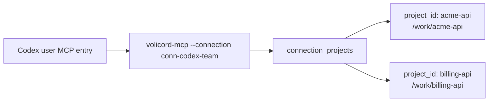

# Multi-Repository Agent Setup

Use this guide when one user-scope Agent Connection should serve multiple explicitly connected `Product Repository` registrations.

The baseline topology is:



There is one host MCP entry, one `volicord-mcp --connection <connection_id>` process, and multiple explicitly connected Projects. Adding one Project does not grant access to every Runtime Home Project. Removing one connected Project takes effect through registry state without rewriting the host entry.

Project and local host scopes remain single-Project scopes. Use user scope for this topology.

## Prerequisites And Completion

Before adding a second repository, complete user-scope host setup for Product Repository A through [Agent Host Setup](agent-host-setup.md). The connection can be `complete`, or it can be `action_required` only when the remaining action is host-owned trust, approval, reload, restart, or comparable follow-up documented by [Agent Host Troubleshooting](agent-host-troubleshooting.md#status-action_required).

This guide is complete when one user-scope host entry points at one `connection_id`, the connection has the intended connected Projects, the agent uses `volicord.list_projects` or explicit `project_id` for multi-repository calls, and removal or re-addition is performed through project membership commands rather than host-file edits.

## Executable Convention

```sh
export VOLICORD_BIN="/absolute/path/to/selected/bin"
```

Administrative commands use `"$VOLICORD_BIN/volicord"`.

## Connect Product Repository A

```sh
"$VOLICORD_BIN/volicord" agent connect \
  --host codex \
  --scope user \
  --server-name volicord-main \
  --connection-id conn-codex-team \
  --mode workflow \
  --project-id acme-api \
  --repo-root /work/acme-api \
  --runtime-home /Users/alex/.volicord \
  --mcp-command "$VOLICORD_BIN/volicord-mcp"
```

The host config has one server entry:

```toml
[mcp_servers.volicord-main]
command = "/absolute/path/to/selected/bin/volicord-mcp"
args = ["--connection", "conn-codex-team"]

[mcp_servers.volicord-main.env]
VOLICORD_HOME = "/Users/alex/.volicord"
```

## Add Product Repository B

```sh
"$VOLICORD_BIN/volicord" agent project add \
  --connection-id conn-codex-team \
  --project-id billing-api \
  --repo-root /work/billing-api \
  --runtime-home /Users/alex/.volicord
```

`volicord agent project add` reuses `billing-api` if that Project is already registered in the selected Runtime Home. If it is not registered, this command can register it because `--repo-root /work/billing-api` is supplied, then add the Connection Project row. The command does not rewrite host configuration.

Confirm the host still has one MCP server entry:

```sh
"$VOLICORD_BIN/volicord" agent status \
  --connection-id conn-codex-team \
  --runtime-home /Users/alex/.volicord
```

Status should list both `acme-api` and `billing-api` as connected Projects.

## What The Agent Should Do

When a user asks which repositories are available, the agent calls:

```json
{"name":"volicord.list_projects","arguments":{}}
```

The MCP result identifies the `connection_id`, mode, and connected Projects. A workflow call that targets one repository must include explicit `project_id` once more than one Project is connected:

```json
{
  "project_id": "billing-api",
  "request_id": "req_billing_status_001",
  "include": {
    "task": true
  }
}
```

When exactly one Project is connected, the MCP adapter can derive `project_id`. When multiple Projects are connected, ambiguous calls are rejected instead of silently selecting a Project.

## Remove Or Re-Add One Project

```sh
"$VOLICORD_BIN/volicord" agent project remove \
  --connection-id conn-codex-team \
  --project-id billing-api \
  --runtime-home /Users/alex/.volicord
```

Removing a connected Project does not delete the Project registration, Product Repository, project state, Core task/evidence/run/artifact records, or host configuration. It only removes that Project from the Agent Connection.

Re-add it with the same `project add` command used above. The host entry still points to the same `connection_id`.

## Zero Connected Projects

If every Project is removed from a connection, the host configuration may remain but the MCP process is not eligible to route project-specific tools. `volicord.list_projects` may return an empty Project list, and project-routed tools are rejected until a Project is connected again.

For troubleshooting this state, see [host configuration remains while no project is currently connected](agent-host-troubleshooting.md#host-config-remains-zero-projects).

## Uninstall

```sh
"$VOLICORD_BIN/volicord" agent uninstall \
  --connection-id conn-codex-team \
  --runtime-home /Users/alex/.volicord \
  --dry-run
```

Then run without `--dry-run` when the planned effects are the intended ones. If uninstall reports a partial result, use [Removal completed only partially](agent-host-troubleshooting.md#partial-removal) before retrying cleanup.

## Boundaries

- Agent Connections access only explicitly connected Projects.
- Multiple connected Projects require explicit `project_id` in MCP calls unless the call is `volicord.list_projects`.
- A `Product Repository` is a product-file boundary and may contain selected project-scoped host configuration, but it is not Core authority.
- `Write Check` is Core-state compatibility, not OS permission.
- Volicord does not provide OS sandboxing, filesystem ACLs, network policy, or secret isolation.
