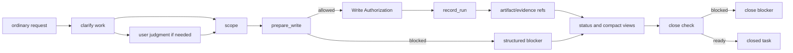

# Build: 런타임 설계 흐름

## 이 문서가 도와주는 일

이 문서는 의도한 하네스 런타임 동작을 설계 흐름으로 보여 줍니다. 구현자는 사용자 평소 요청 하나가 어떻게 scope, write authority, evidence, status, close outcome으로 이어져야 하는지 볼 수 있습니다.

이 문서는 런타임이 존재한다는 증거가 아닙니다. [구현 개요](implementation-overview.md#문서-수락-상태)의 handoff gate가 수락되기 전에는 server/runtime 구현, generated operational artifact, executable fixture, runtime data, new schema를 허가하지 않습니다.

## 이런 때 읽기

- 모든 Reference 계약을 읽기 전에 request-to-close 이해 모델이 필요할 때.
- 제안된 구현 경로가 state, artifact, projection, blocker를 분리하는지 확인할 때.
- 어떤 부분이 내부 엔지니어링 점검이고 어떤 부분이 MVP-1 또는 이후 범위인지 보고 싶을 때.

## 핵심 생각

하네스 런타임 동작은 Core가 소유한 상태와 artifact ref를 통해 로컬 권한을 보존해야 합니다. Chat text, generated Markdown, connector output, projection view는 작업을 읽는 데 도움을 줄 수 있지만 authority가 되지 않습니다.

내부 엔지니어링 점검은 이 경로의 내부 가운데만 구현합니다. Project, Task, scope, `prepare_write`, single-use Write Authorization, `record_run`, artifact/evidence ref 하나, status/blocker output입니다.

MVP-1은 그 loop 주변의 사용자 표시 동작을 더합니다. Ordinary-language start/resume, work-shape classification, scope/non-goals/success criteria, minimal user judgment, evidence summary, close blocker, next safe action, residual-risk visibility, approval/acceptance/risk 분리 표시입니다.

## 한눈에 보는 의도한 경로

이 diagram은 reader aid입니다. Exact state transition, schema, DDL, error, projection rule은 Reference 담당 문서에 남습니다.

## 단계별 설계 경로

### 1. Request -> Task

사용자는 평소 언어로 작업을 설명합니다. MVP-1은 tracked work를 시작하거나 이어갈지 판단하고 work shape를 분류해야 합니다. 내부 엔지니어링 점검은 natural-language intake 대신 owner-valid setup 또는 seed path를 사용할 수 있습니다.

담당 문서: [Core Model 참조](../reference/core-model.md), [MVP API](../reference/api/mvp-api.md), [Storage](../reference/storage.md).

### 2. Task -> 구체화

요청이 모호하거나, 위험하거나, 제품-facing이거나, 사용자 판단이 필요할 가능성이 있으면 하네스는 goal, non-goal, success criteria, inspectable fact, assumption, likely judgment boundary를 구체화합니다. 이것은 shaping input입니다. Evidence, Approval, Write Authorization, work acceptance, residual-risk acceptance, close가 아닙니다.

담당 문서: [Core Model 참조: User Judgment](../reference/core-model.md#user-judgment), [`harness.request_user_judgment`](../reference/api/mvp-api.md#harnessrequest_user_judgment).

### 3. 구체화 -> scope

다음 안전한 작업 경계가 제품 변경의 scope가 됩니다. Scope는 무엇이 바뀔 수 있고 무엇이 범위 밖인지 말합니다. Scope record 자체는 write를 authorize하지 않습니다.

담당 문서: [Core Model 참조: Change Unit](../reference/core-model.md#change-unit), [Autonomy Boundary](../reference/core-model.md#autonomy-boundary).

### 4. Scope -> `prepare_write`

Product write 전에 agent 또는 surface는 intended write가 현재 record와 compatible한지 Core에 묻습니다. MVP-1에서 이것은 cooperative pre-write scope check입니다. OS-level blocking이나 tool isolation이 아닙니다.

담당 문서: [Core Model 참조: `prepare_write`](../reference/core-model.md#prepare_write), [`harness.prepare_write`](../reference/api/mvp-api.md#harnessprepare_write), [보안 참조](../reference/security.md).

### 5. `prepare_write` -> Write Authorization 또는 blocker

Check를 통과하면 Core는 한 번의 attempt에 맞는 Write Authorization을 돌려줍니다. 실패하면 blocker, state conflict, missing judgment path, local-access error, 또는 owner-defined response를 돌려줍니다.

담당 문서: [Core Model 참조: Write Authorization](../reference/core-model.md#write-authorization), [API Errors](../reference/api/errors.md).

### 6. Write Authorization -> Run

Product write나 direct work 뒤에는 `record_run`이 무엇이 일어났는지 기록합니다. Product-write Run은 compatible하고 expired되지 않았고 unconsumed인 Write Authorization 하나를 소비합니다.

담당 문서: [Core Model 참조: `record_run`](../reference/core-model.md#record_run), [`harness.record_run`](../reference/api/mvp-api.md#harnessrecord_run), [런타임 아키텍처 참조](../reference/runtime-architecture.md#state-transaction-flow).

### 7. Run -> evidence와 artifact 연결

Evidence는 claim을 registered artifact ref 또는 owner record에 연결합니다. 내부 엔지니어링 점검에는 ref 하나가 필요합니다. MVP-1에는 evidence summary와 visible gap이 필요합니다. Detailed Evidence Manifest behavior는 승격 전까지 later-profile scope입니다.

담당 문서: [Core Model 참조: Evidence Manifest](../reference/core-model.md#evidence-manifest), [API Schema Core: ArtifactRef](../reference/api/schema-core.md#artifactref), [Storage](../reference/storage.md).

### 8. Evidence -> status와 compact view

Status와 compact view는 Core state와 artifact ref를 읽습니다. 사용자가 scope, pending judgment, evidence gap, blocker, next safe action, acceptance, residual risk를 볼 수 있게 돕습니다. Write를 authorize하거나, evidence를 satisfy하거나, work를 close하지 않습니다.

담당 문서: [`harness.status`](../reference/api/mvp-api.md#harnessstatus), [API Schema Core](../reference/api/schema-core.md), [Projection과 Template 참조](../reference/projection-and-templates.md).

### 9. Status -> close blocker 또는 close

Close가 stage 범위에 있으면 Core는 close-relevant state를 확인하고 Task를 close하거나 blocker를 반환합니다. 내부 엔지니어링 점검은 좁은 status/close blocker smoke만 사용할 수 있습니다. MVP-1에는 close blocker display와 work acceptance/residual-risk acceptance 분리가 필요합니다. Full assurance close semantics는 later-profile scope입니다.

담당 문서: [Core Model 참조: `close_task`](../reference/core-model.md#close_task), [`harness.close_task`](../reference/api/mvp-api.md#harnessclose_task), [API Errors](../reference/api/errors.md).

## 단계 경계

| 단계 | Walkthrough에서 범위에 들어오는 부분 |
|---|---|
| 내부 엔지니어링 점검 | Project, Task, scope, `prepare_write`, Write Authorization, `record_run`, artifact/evidence ref 하나, status/blocker output. |
| MVP-1 사용자 작업 루프 | 내부 엔지니어링 점검에 ordinary-language start/resume, work-shape classification, minimal user judgment, evidence summary, close blocker summary, next safe action, residual-risk visibility, compact view를 더합니다. |
| 보증 프로필 | Verification, Manual QA, richer work acceptance/residual-risk behavior, stewardship, TDD, feedback-loop, context-hygiene hardening. |
| 운영 프로필 | Doctor/readiness, recover/export, artifact integrity, release handoff, projection/reconcile operations, suite가 존재한 뒤 conformance runner. |
| 로드맵 | Dashboard, hosted UI, broad connector, automation, metrics, team workflow, promoted future candidate. |

첫 내부 smoke는 [내부 엔지니어링 점검](engineering-checkpoint.md)을 사용하고, 첫 사용자 가치 계획은 [MVP-1 사용자 작업 루프](mvp-user-work-loop.md)를 사용합니다.
