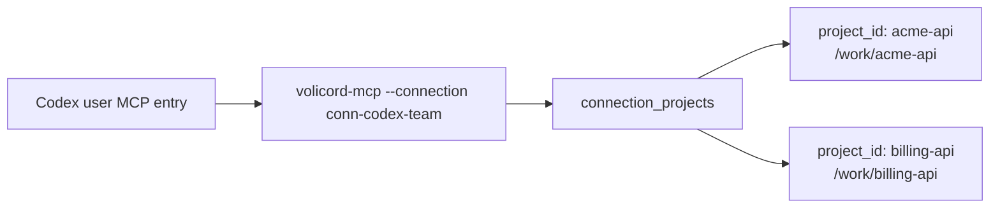

# 여러 저장소 Agent Setup

하나의 사용자 범위 Agent Connection이 명시적으로 연결된 여러 `Product Repository` 등록을 섬겨야 할 때 이 가이드를 사용합니다.

기준 토폴로지:



호스트 MCP 항목 하나, `volicord-mcp --connection <connection_id>` 프로세스 하나, 명시적으로 연결된 여러 Project가 있습니다. Project 하나를 추가해도 Runtime Home의 모든 Project 접근을 부여하지 않습니다. 연결된 Project 하나를 제거하면 호스트 항목을 다시 쓰지 않고 registry 상태를 통해 반영됩니다.

`project`와 `local` 호스트 범위는 단일 Project 범위로 남습니다. 이 토폴로지에는 `user` 범위를 사용합니다.

## 프로젝트 선택 흐름

정확한 프로젝트 선택 의미와 전송 동작은 [Agent Connection](../reference/agent-connection.md#current-connection-context)과 [MCP 전송](../reference/mcp-transport.md)을 사용합니다. 이 가이드에서 실무 규칙은 아래와 같습니다.

| MCP 호출 형태 | Agent Connection에 연결된 Project | 어댑터 동작 | 에이전트 동작 |
|---|---:|---|---|
| `volicord.list_projects` | 0개, 1개, 여러 개 | 묶인 Agent Connection을 통해 보이는 Project를 Core에 들어가지 않고 반환합니다. | 반환된 `project_id` 값을 사용합니다. 목록이 비어 있으면 운영자에게 Project 연결을 요청합니다. |
| `envelope.project_id`가 있는 공개 Volicord 메서드 도구 | 0개, 1개, 여러 개 | 선택한 Project가 연결되어 있고 사용할 수 있는지 Core 실행 전에 검증합니다. | `volicord.list_projects`가 반환한 `project_id`를 사용합니다. 경로나 기억에서 지어내면 안 됩니다. |
| `envelope.project_id`가 없는 공개 Volicord 메서드 도구 | 정확히 1개 | 그 단일 Project로 라우팅할 수 있으며, 그 뒤에도 프로젝트 가용성, 모드, 메서드 점검을 적용합니다. | connection이 단일 Project 상태로 남아 있을 때만 생략할 수 있습니다. |
| `envelope.project_id`가 없는 공개 Volicord 메서드 도구 | 여러 개 | Core 실행 전에 모호한 호출로 거절합니다. | `volicord.list_projects`를 호출하고 의도한 Project를 고른 뒤 명시적 `envelope.project_id`와 함께 다시 시도합니다. |
| `envelope.project_id`가 없는 공개 Volicord 메서드 도구 | 0개 | 연결된 Project가 없으므로 Core 실행 전에 거절합니다. | Project 라우팅 도구를 다시 시도하기 전에 운영자에게 Project 연결을 요청합니다. |

## 전제 조건과 완료

두 번째 저장소를 추가하기 전에 [에이전트 호스트 Setup](agent-host-setup.md)을 통해 Product Repository A의 사용자 범위 호스트 setup을 완료합니다. connection은 `complete`일 수 있습니다. 또는 남은 동작이 [에이전트 호스트 문제 해결](agent-host-troubleshooting.md#status-action_required)이 설명하는 호스트 소유 trust, approval, reload, restart, 또는 그에 준하는 후속 조치일 때만 `action_required`일 수 있습니다.

이 가이드는 사용자 범위 호스트 항목 하나가 하나의 `connection_id`를 가리키고, connection에 의도한 Project가 연결되어 있으며, 에이전트가 여러 저장소 호출에 `volicord.list_projects`나 명시적 `project_id`를 사용하고, 제거 또는 재추가를 호스트 파일 편집이 아니라 project membership 명령으로 수행할 때 완료입니다.

## 실행 파일 관례

```sh
export VOLICORD_BIN="/absolute/path/to/selected/bin"
```

관리 명령은 `"$VOLICORD_BIN/volicord"`를 사용합니다.

## Product Repository A 연결

```sh
"$VOLICORD_BIN/volicord" agent connect \
  --host codex \
  --scope user \
  --server-name volicord-main \
  --connection-id conn-codex-team \
  --mode workflow \
  --project-id acme-api \
  --repo-root /work/acme-api \
  --runtime-home /Users/alex/.volicord \
  --mcp-command "$VOLICORD_BIN/volicord-mcp"
```

호스트 설정에는 서버 항목 하나가 있습니다.

```toml
[mcp_servers.volicord-main]
command = "/absolute/path/to/selected/bin/volicord-mcp"
args = ["--connection", "conn-codex-team"]

[mcp_servers.volicord-main.env]
VOLICORD_HOME = "/Users/alex/.volicord"
```

## Product Repository B 추가

```sh
"$VOLICORD_BIN/volicord" agent project add \
  --connection-id conn-codex-team \
  --project-id billing-api \
  --repo-root /work/billing-api \
  --runtime-home /Users/alex/.volicord
```

`volicord agent project add`는 선택된 Runtime Home에 `billing-api` Project가 이미 등록되어 있으면 재사용합니다. 등록되어 있지 않으면 `--repo-root /work/billing-api`가 제공되었으므로 등록한 뒤 Connection Project 행을 추가할 수 있습니다. 이 명령은 호스트 설정을 다시 쓰지 않습니다.

호스트에 여전히 MCP 서버 항목 하나만 있는지 확인합니다.

```sh
"$VOLICORD_BIN/volicord" agent status \
  --connection-id conn-codex-team \
  --runtime-home /Users/alex/.volicord
```

Status는 `acme-api`와 `billing-api`를 연결된 Project로 나열해야 합니다.

## 에이전트가 해야 할 일

사용자가 사용 가능한 저장소를 물으면 에이전트는 아래를 호출합니다.

```json
{"name":"volicord.list_projects","arguments":{}}
```

MCP 결과는 `connection_id`, mode, 연결된 Project를 식별합니다. 둘 이상의 Project가 연결된 뒤 한 저장소를 대상으로 하는 공개 Volicord 메서드 도구 호출은 명시적 `project_id`를 포함해야 합니다.

```json
{
  "project_id": "billing-api",
  "request_id": "req_billing_status_001",
  "include": {
    "task": true
  }
}
```

정확히 하나의 Project만 연결되어 있으면 MCP 어댑터가 `project_id`를 파생할 수 있습니다. 여러 Project가 연결되어 있으면 모호한 호출은 조용히 Project를 고르지 않고 거부됩니다.

## Project 하나 제거 또는 재추가

```sh
"$VOLICORD_BIN/volicord" agent project remove \
  --connection-id conn-codex-team \
  --project-id billing-api \
  --runtime-home /Users/alex/.volicord
```

연결된 Project 제거는 Project registration, Product Repository, project state, Core task/evidence/run/artifact 기록, 호스트 설정을 삭제하지 않습니다. 해당 Project를 Agent Connection에서만 제거합니다.

위의 `project add` 명령으로 다시 추가합니다. 호스트 항목은 여전히 같은 `connection_id`를 가리킵니다.

## 연결된 Project가 0개인 상태

connection에서 모든 Project를 제거하면 호스트 설정은 남을 수 있지만 MCP 프로세스가 project-specific 도구를 라우팅할 자격은 없습니다. `volicord.list_projects`는 빈 Project 목록을 반환할 수 있고, Project 라우팅 도구는 Project가 다시 연결될 때까지 거부됩니다.

이 상태의 문제 해결은 [현재 연결된 Project가 없지만 호스트 설정이 남아 있음](agent-host-troubleshooting.md#host-config-remains-zero-projects)을 봅니다.

## 제거

```sh
"$VOLICORD_BIN/volicord" agent uninstall \
  --connection-id conn-codex-team \
  --runtime-home /Users/alex/.volicord \
  --dry-run
```

계획된 효과가 의도한 것이라면 `--dry-run` 없이 실행합니다. uninstall이 부분 정리 결과를 보고하면 정리를 다시 시도하기 전에 [제거가 일부만 완료됨](agent-host-troubleshooting.md#partial-removal)을 사용합니다.

## 경계

- Agent Connection은 명시적으로 연결된 Project에만 접근합니다.
- 여러 Project가 연결되어 있으면 `volicord.list_projects`가 아닌 MCP 호출에는 명시적 `project_id`가 필요합니다.
- `Product Repository`는 제품 파일 경계이며 선택된 프로젝트 범위 호스트 설정을 포함할 수 있지만 Core 권한이 아닙니다.
- `Write Check`은 Core 상태 호환성이지 OS 권한이 아닙니다.
- Volicord는 OS 샌드박싱, 파일시스템 ACL, 네트워크 정책, 비밀 격리를 제공하지 않습니다.
