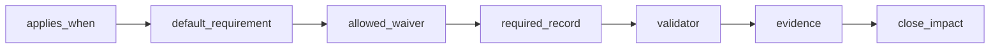
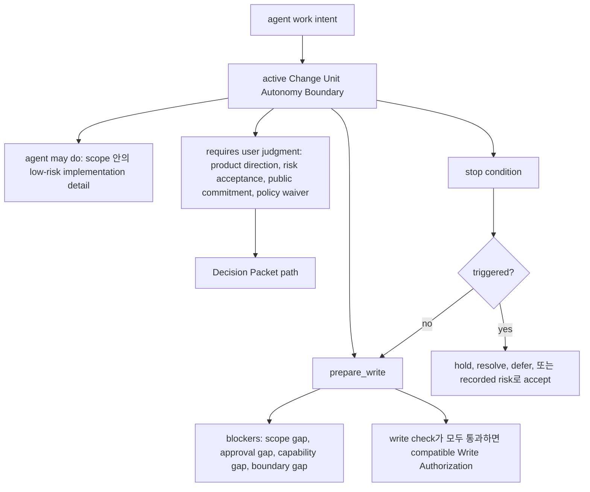
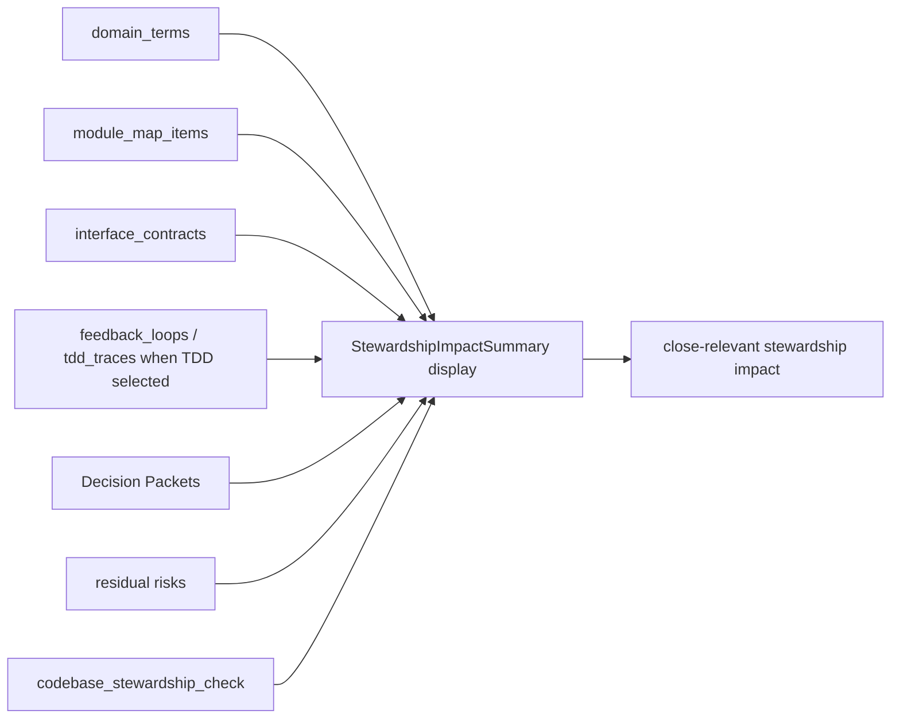
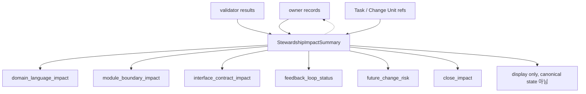
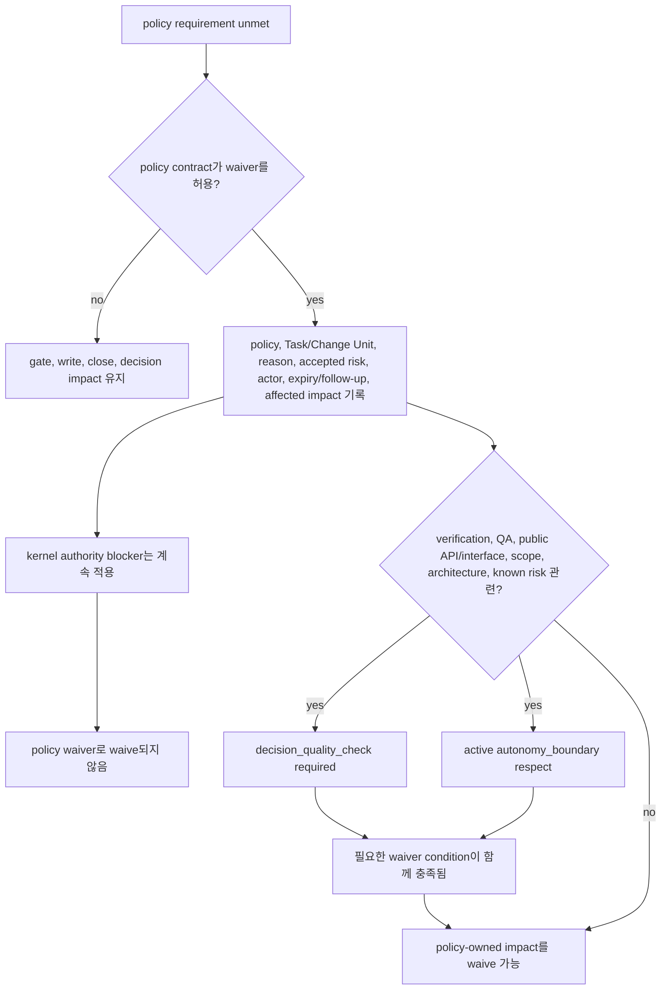
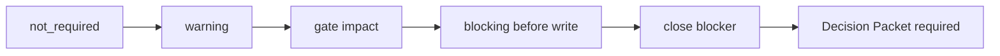

# 설계 품질 정책

## 이 문서가 도와주는 일

이 참조 문서는 design-quality policy의 적용 조건, 필요한 record와 evidence, 결과를 보고하는 stable validator, 그리고 충족되지 않은 requirement가 write gate나 close에 미치는 영향을 확인할 때 사용합니다.

이 정책들은 AI 지원 작업이 제품 설계, domain language, module boundary, testing discipline, human QA, context hygiene와 어긋나지 않도록 돕습니다. 동시에 모든 품질 선호를 kernel invariant로 승격하지는 않습니다.

이 문서는 MCP schema, SQLite DDL, state transition table, runtime behavior, server behavior, full projection template을 정의하지 않습니다.

## 이런 때 읽기

- 작업을 shaping하면서 어떤 design-quality record가 필요한지 확인할 때.
- design-quality validator result를 assert하는 conformance fixture를 작성하거나 검토할 때.
- Task가 왜 `design_gate`, `decision_gate`, `qa_gate`의 영향을 받는지 이해해야 할 때.
- policy waiver가 허용되는지 판단할 때.
- close blocker, Decision Packet 필요성, Manual QA requirement, stewardship finding을 검토할 때.

## 정책을 쉬운 말로

| Policy area | 쉬운 질문 |
|---|---|
| `shared_design` | 목표, 범위, non-goal, assumption, 첫 safe Change Unit에 대해 합의했는가? |
| `decision_quality` | 제품, 설계, architecture, waiver, risk 선택에 기록된 판단 경로가 필요한가? |
| `autonomy_boundary` | Agent가 혼자 할 수 있는 일과 user judgment를 위해 멈춰야 하는 지점은 무엇인가? |
| `vertical_slice` | 작업이 얇은 end-to-end slice로 잡혔는가, 아니면 horizontal exception이 기록됐는가? |
| `feedback_loop` | Agent는 쓰기 전후에 change가 동작하는지 어떻게 배울 것인가? |
| `tdd_trace` | TDD가 required이거나 가장 알맞은 방식일 때 RED, GREEN, 관련 check evidence가 기록됐는가? |
| `domain_language` | Product term과 code term이 계속 정렬되어 있는가? |
| `deep_module_interface` | Module role, public interface, compatibility, caller 영향이 이해되었는가? |
| `codebase_stewardship` | Local task completion이 future maintenance, testability, domain, boundary 손상을 숨기고 있지 않은가? |
| `manual_qa` | UX, workflow, copy, accessibility, visual output, product taste를 사람이 직접 봐야 하는가? |
| `context_hygiene` | Agent가 stale chat이나 old document가 아니라 현재의 집중된 context를 쓰고 있는가? |
| `two_stage_review_display` | Spec compliance와 code stewardship을 새 gate 없이 분리해 보여 주는가? |

## 담당하는 참조 범위

이 문서가 담당합니다.

- design-quality policy contract
- policy-to-validator mapping
- stable design-quality validator ID
- severity composition rule
- policy waiver semantics
- policy evidence 기대사항
- policy가 close에 미치는 영향
- two-stage review display와 policy validator의 관계
- design-quality policy가 `decision_gate`, `design_gate`, `qa_gate`, evidence sufficiency, `prepare_write` blocker, close blocker에 영향을 주는 시점

## 여기서 다루지 않는 것

이 문서는 다음 항목을 담당하지 않습니다.

- kernel lifecycle transition. [커널 참조](kernel.md)를 봅니다.
- gate enum definition. [커널 참조](kernel.md)와 [MCP API와 스키마](mcp-api-and-schemas.md)를 봅니다.
- public MCP request/response schema. [MCP API와 스키마](mcp-api-and-schemas.md)를 봅니다.
- SQLite DDL 또는 storage layout. [Storage와 DDL](storage-and-ddl.md)을 봅니다.
- projection template body. [문서 Projection 참조](document-projection.md)와 [Template 참조](templates/README.md)를 봅니다.
- operator command semantics. [운영과 Conformance](../11-operations-and-conformance.md)를 보고, 이후 경로는 `reference/operations-and-conformance.md`입니다.
- connector capability profile 또는 surface recipe. [Agent 통합](../09-agent-integration.md)을 보고, 이후 경로는 `reference/agent-integration.md`입니다.
- 사용자가 읽는 session procedure

## 정책이 kernel invariant가 되지 않고 gate에 영향을 주는 방식

Kernel은 lifecycle, gate transition, close semantics, blocker mechanics, state transition, `prepare_write`, `close_task`를 담당합니다.

Design-quality policy는 kernel 위에 놓이는 policy contract입니다. 이 policy는 언제 `decision_gate`, `design_gate`, `qa_gate`, evidence sufficiency, `prepare_write` blocker, close blocker에 영향을 줄 수 있는지 설명합니다. 하지만 새 kernel transition, 새 canonical source of truth, scope, approval, evidence, verification, acceptance, residual-risk rule의 대체물을 만들지는 않습니다.

Policy waiver도 제한적입니다. Policy contract가 허용하는 경우에만 design-quality requirement를 충족한 것으로 볼 수 있습니다. Product write scope, sensitive-change approval, required evidence coverage, required acceptance, verification independence를 대신 면제하지 않습니다.

## Two-stage review model

Review guidance는 agent와 user가 "요청한 것을 만들었는가?"와 "구현이 유지보수 가능한가?"를 분리해 볼 수 있도록 두 stage로 표시됩니다. 이 stage는 절차와 표시 방식일 뿐이며, 새 kernel gate, schema, canonical record를 만들지 않습니다.

| Stage | Question | Typical coverage |
|---|---|---|
| Spec Compliance Review | 현재 Harness authority 안에서 요청된 task를 만족했는가? | Acceptance criteria coverage, Change Unit completion conditions, scope 및 Write Authority compatibility, Decision Packet compatibility, evidence coverage, residual-risk visibility. |
| Code Quality / Stewardship Review | 이 implementation이 codebase 안에서 maintainable한가? | Domain language, module/interface boundary, vertical slice shape, feedback loop 또는 TDD trace, codebase stewardship, context hygiene, follow-up risk. |

Review stage는 validator result, evidence gap, Decision Packet candidate, Change Unit update recommendation, residual-risk candidate, close blocker를 요약할 수 있습니다. 그 자체로 evidence, QA, verification, acceptance, residual-risk acceptance, approval, scope, Write Authorization을 충족하지 않습니다.

Same-session review는 detached verification이 아닙니다. 통과한 two-stage review는 `self_checked` confidence를 뒷받침하고 finding을 state로 연결할 수 있지만 `assurance_level=detached_verified`를 만들면 안 됩니다. Detached verification에는 여전히 valid independence boundary와 Eval path가 필요합니다.

## Policy contract 형태

각 policy는 동일한 field를 사용합니다.

| Field | Meaning |
|---|---|
| `name` | Stable policy name. |
| `applies_when` | Policy가 관련되는 조건. |
| `default_requirement` | 적용될 때 기본적으로 일어나야 하는 것. |
| `allowed_waiver` | 누가 waiver를 적용할 수 있고 무엇을 기록해야 하는지. |
| `required_record` | 결과를 저장하는 canonical state record 또는 record family. |
| `validator` | compliance, warning, failure, blocker를 보고하는 validator. |
| `evidence` | Policy가 기대하는 evidence 또는 projection ref. |
| `close_impact` | 충족되지 않은 requirement가 close 또는 gate에 미치는 영향. |

Policy validator는 MCP API document가 담당하는 validator result schema를 반환합니다.

## Policy contracts

### Shared Design (`shared_design`)

이럴 때 사용합니다:

- Request가 모호하거나 첫 safe Change Unit이 분명하지 않을 때.
- Scope, non-scope, acceptance criteria, user value alignment가 필요할 때.
- Public interface, schema, auth, UX, workflow behavior가 바뀔 수 있을 때.
- `work` task가 implementation 전에 shaping을 필요로 할 때.

예: 사용자가 "onboarding을 더 좋게" 해 달라고 요청하면, 쓰기 전에 goal, non-goal, acceptance criteria, rejected option, 첫 얇은 onboarding Change Unit을 기록합니다.

| Field | Contract |
|---|---|
| `name` | `shared_design` |
| `applies_when` | Work request가 모호하거나, scope/non-scope가 분명하지 않거나, user value alignment가 필요하거나, public interface/schema/auth/UX/workflow가 영향을 받거나, `work` task에 shaping이 필요할 때. |
| `default_requirement` | Goal, scope, non-goal, acceptance criteria, blocking decision, assumption, rejected option, domain-language impact, module/interface impact, first Change Unit shape를 기록한다. Agent assumption과 user judgment가 필요한 선택을 구분하고, 가장 blocking한 question을 한 번에 하나씩 묻고, 첫 safe Change Unit을 제안할 수 있으면 멈춘다. |
| `allowed_waiver` | User/operator가 reason과, design risk가 남는 경우 follow-up을 기록하면 작고 명확한 `direct` work, docs-only edit, emergency fix에 허용된다. |
| `required_record` | Shared Design record, Task shaping field, decision record, 선택적 `DESIGN` 또는 `DEC` projection. |
| `validator` | `shared_design_alignment` |
| `evidence` | Task summary, acceptance criteria, decision ref, rejected option ref, domain/module/interface impact ref. |
| `close_impact` | Required인데 없으면 `design_gate=pending` 또는 `partial`로 설정하거나 유지한다. Risk가 높고 waiver가 없으면 close를 차단한다. Valid waiver는 `design_gate=waived`를 허용할 수 있다. |

### Decision Quality (`decision_quality`)

이럴 때 사용합니다:

- Choice가 product direction, scope, architecture, public API, interface, compatibility를 바꿀 때.
- Waiver가 QA 또는 verification waiver risk를 포함한 known risk를 수용할 때.
- Horizontal exception이 design 또는 architecture choice일 때.
- Agent recommendation은 있지만 judgment는 user가 소유할 때.

예: Breaking API change가 더 단순해 보이면, 실행 전에 option, trade-off, compatibility risk, recommendation, user decision을 기록합니다.

| Field | Contract |
|---|---|
| `name` | `decision_quality` |
| `applies_when` | Design choice, product trade-off, scope expansion, public API/interface change, architecture choice, horizontal exception, verification waiver, QA waiver, known risk가 있는 acceptance가 있을 때. |
| `default_requirement` | Decision이 실행되기 전에 Decision Packet을 기록한다. Packet에는 context, considered option, trade-off, recommendation, uncertainty, reversibility, evidence ref, deferral consequence, residual risk가 포함되어야 한다. Agent recommendation과 user judgment 또는 risk acceptance를 분리해 둔다. `decision_kind=approval`에서는 sensitive-change scope와 boundary가 명확한지 평가하고, approval-shaped context를 product judgment resolution으로 취급하지 않는다. |
| `allowed_waiver` | Public interface, product, architecture, verification, QA, known-risk impact가 없고 사소하며 되돌리기 쉬운 choice에만 허용된다. Waiver에는 Decision Packet이 judgment를 개선하지 않는 이유를 기록해야 한다. |
| `required_record` | Decision Packet record와 렌더링될 때 선택적 `DEC` projection. |
| `validator` | `decision_quality_check` |
| `evidence` | Decision Packet ref, option ref, evidence manifest ref, risk/waiver ref, risk acceptance가 포함될 때 residual-risk state ref, user judgment가 필요할 때 user acceptance ref. |
| `close_impact` | Blocking product judgment에 필요한 decision quality가 없으면 `decision_gate=required`, `pending`, 또는 `blocked`로 설정하거나 유지한다. Design quality에 영향을 주는 decision일 때만 `design_gate`에 반영한다. Unresolved user judgment, invalid deferral, unaccepted residual risk는 affected write 또는 close를 차단한다. Valid recorded acceptance는 residual risk를 state ref에 보존한 채 close를 허용할 수 있다. |

### Autonomy Boundary (`autonomy_boundary`)

이럴 때 사용합니다:

- Agent는 implementation detail을 진행할 수 있지만 product judgment에서는 멈춰야 할 때.
- Task에 ambiguous authority, user constraint, sensitive action, external side effect, irreversible edit가 있을 때.
- Scope expansion, public commitment, known stop condition이 나타날 수 있을 때.
- Active Change Unit에 "agent may do"와 "ask first" boundary가 필요할 때.

예: Agent는 scope 안에서 local helper 이름을 refactor할 수 있지만 public CLI flag contract를 바꾸거나 user 대신 risk를 수용하기 전에는 멈춰야 합니다.

| Field | Contract |
|---|---|
| `name` | `autonomy_boundary` |
| `applies_when` | Agent가 authority가 모호하거나, user constraint, external side effect, irreversible edit, scope expansion, sensitive action, product judgment, public commitment, known stop condition이 있는 작업을 shaping하거나 실행할 때. |
| `default_requirement` | Agent가 user input 없이 할 수 있는 것, user judgment가 필요한 것, stop condition을 기록한다. Canonical boundary는 active Change Unit에 둔다. Change Unit이 아직 없으면 Task 또는 Shared Design이 shaping/proposed boundary ref를 가질 수 있다. Boundary는 low-risk implementation detail에서는 agent가 진행하게 하되, product direction, risk acceptance, public interface commitment, human judgment가 필요한 policy waiver에서는 멈추게 해야 한다. Autonomy Boundary는 scope grant가 아니며 active Change Unit 밖의 path, tool, command, network, secret, sensitive category를 허가하지 않는다. |
| `allowed_waiver` | 요청에서 authority가 명확하고 stop condition이 현실적으로 발생할 수 없는 좁은 `direct` work에 허용된다. Waiver에는 autonomy boundary가 필요 없는 이유를 기록해야 한다. |
| `required_record` | Active Change Unit의 canonical Autonomy Boundary record, Change Unit 생성 전 Task 또는 Shared Design shaping/proposed boundary ref, user-judgment item에 대한 Decision Packet record, trigger된 stop-condition ref. |
| `validator` | `autonomy_boundary_check` |
| `evidence` | User request ref, task constraint, policy ref, Decision Packet ref, stop-condition event, user response ref. |
| `close_impact` | `prepare_write`에서 발생한 stop condition 또는 boundary gap은 write를 차단한다. Product-judgment gap은 Decision Packet을 요청하거나 참조해야 하며 `decision_gate`에 영향을 준다. Design-quality gap은 `design_gate`에 영향을 줄 수 있다. Scope, approval, capability gap은 각자의 blocker로 남는다. Unresolved stop condition은 resolved, deferred, 또는 recorded risk로 accepted될 때까지 close를 차단할 수 있다. |

### Vertical Slice (`vertical_slice`)

이럴 때 사용합니다:

- Task가 feature, user-visible behavior, workflow, integration path를 추가하거나 바꿀 때.
- Medium/large `work` task에 작은 end-to-end delivery shape가 필요할 때.
- Horizontal enabling slice가 제안되어 recorded exception이 필요할 때.
- Follow-up vertical risk를 보이게 남겨야 할 때.

예: Notification feature에서는 UI가 작더라도 trigger에서 domain logic, persistence, observable output, test evidence까지 이어지는 slice를 선호합니다.

| Field | Contract |
|---|---|
| `name` | `vertical_slice` |
| `applies_when` | Feature work, user-visible behavior, workflow change, integration behavior, medium/large `work` task. |
| `default_requirement` | Trigger/input, domain logic, persistence 또는 state, API/caller boundary, observable output, test evidence, optional Manual QA를 연결하는 thin end-to-end Change Unit을 선호한다. |
| `allowed_waiver` | Scaffold, test harness, deep module boundary, migration safety, public interface decision이 먼저 필요할 때 horizontal/enabling Change Unit을 허용한다. Change Unit은 `horizontal_exception_reason`을 기록하고, exception이 design 또는 architecture choice라면 Decision Packet을 연결하며, 아직 의미 있는 end-to-end path가 없다는 이유가 기록되지 않는 한 follow-up vertical Change Unit을 기록해야 한다. |
| `required_record` | Change Unit field: `slice_type`, end-to-end path, completion condition, follow-up vertical Change Unit, validator result. |
| `validator` | `vertical_slice_shape` |
| `evidence` | Change Unit record, run summary, evidence manifest, test, user-visible인 경우 Manual QA ref. |
| `close_impact` | Vertical slice가 required인데 satisfied 또는 waived가 아니면 `design_gate=partial` 또는 `blocked`로 설정한다. Justified horizontal exception은 follow-up risk가 기록된 경우에만 close를 허용할 수 있다. |

### Feedback Loop (`feedback_loop`)

이럴 때 사용합니다:

- Implementation이 시작되려 할 때.
- Behavior-affecting write에 credible check path가 필요할 때.
- TDD가 waived되어 alternate loop가 confidence를 담당해야 할 때.
- Manual QA, browser smoke, test, typecheck, lint, build output이 evidence가 되어야 할 때.

예: Parser behavior를 바꾸기 전에 작은 loop를 정의합니다. Failing parser fixture, implementation, passing fixture, Evidence Manifest ref 순서입니다.

| Field | Contract |
|---|---|
| `name` | `feedback_loop` |
| `applies_when` | Implementation 시작 전, behavior-affecting write 전, TDD가 waived될 때, Manual QA가 expected될 때, 또는 agent가 change가 작동하는지 배울 credible한 방법이 필요할 때. |
| `default_requirement` | Implementation 전에 feedback loop를 정의한다. Loop는 test, typecheck, lint, build, browser smoke, Manual QA, explicit alternate loop 중 하나일 수 있다. 선택된 loop는 risk에 대해 가장 작은 credible loop여야 한다. Change Unit 또는 behavior slice에 TDD가 required이면 non-test implementation을 시작하기 전에 loop와 intended RED check를 정의한다. TDD trace는 이 policy의 구현 방식 중 하나일 뿐 유일한 구현 방식은 아니다. |
| `allowed_waiver` | Implementation 또는 product behavior impact가 없는 docs-only edit, comment, formatting, advisory work에 허용된다. Waiver에는 executable, browser, Manual QA, alternate loop가 유용하지 않은 이유를 기록해야 한다. |
| `required_record` | `record_kind=feedback_loop`으로 참조되는 canonical `feedback_loops` record, selected-loop refs, validator results, TDD가 선택된 경우 `tdd_traces`, Manual QA가 선택되고 performed된 경우 Manual QA record, required QA가 아직 충족하는 record를 갖지 못한 경우 `qa_gate=pending`, 실행 후 evidence manifest refs. |
| `validator` | `feedback_loop_check` |
| `evidence` | Feedback Loop refs, planned loop refs, test/typecheck/lint/build/browser smoke logs, Manual QA refs, alternate-loop justification, 사용된 경우 TDD trace refs. |
| `close_impact` | Feedback loop definition이 없으면 `design_gate=pending` 또는 `partial`로 남는다. Execution evidence가 없으면 evidence가 insufficient해질 수 있다. Manual QA loop failure는 Manual QA policy를 통해 `qa_gate`에 영향을 준다. Required TDD RED/GREEN/refactor coverage가 missing이면 `tdd_trace_required`를 통해 처리되고 Evidence Manifest coverage도 insufficient해질 수 있다. |

Public mutation path: selected-loop definition과 waiver는 `record_run(kind=shaping_update)` 중 `FeedbackLoopUpdate`로 기록합니다. Execution ref와 status는 implementation/direct run 중 `EvidenceUpdates.feedback_loop_updates`로 갱신하거나, Manual QA가 selected loop일 때 `record_manual_qa.feedback_loop_ref`로 갱신합니다.

### TDD Trace (`tdd_trace`)

이럴 때 사용합니다:

- Change가 domain logic, service behavior, parser/validator behavior, state transition, edge-heavy internal을 건드릴 때.
- Bug fix에 implementation 전 failing check가 필요할 때.
- TDD가 policy, task, Change Unit, user, operator에 의해 선택될 때.
- RED와 GREEN evidence가 behavior path를 설명이 아니라 증명해야 할 때.

예: State transition bug를 고칠 때 non-test implementation 전에 failing transition test를 기록하고, 이후 passing test와 필요한 refactor/check evidence를 기록합니다.

| Field | Contract |
|---|---|
| `name` | `tdd_trace` |
| `applies_when` | Domain logic, service module, bug fix, parser/validator, state transition, deep module internal, edge-case-heavy behavior. API/caller boundary와 integration behavior에는 권장된다. |
| `default_requirement` | TDD가 가장 알맞은 selected feedback loop이거나 Change Unit, behavior slice, policy, user/operator가 `tdd_trace_required`로 표시한 경우 TDD를 사용한다. Normal execution order는 feedback loop와 RED target 정의, RED check 작성 또는 실행, actual RED evidence 기록, actual RED evidence 또는 valid waiver가 있을 때만 non-test implementation 수행, GREEN evidence 기록, relevant한 경우 refactor/check evidence 기록, TDD trace를 Evidence Manifest coverage에 연결하는 순서다. |
| `allowed_waiver` | Docs, typo, throwaway prototype, exploratory UI prototype, initial scaffold, 또는 user/operator가 non-TDD justification과 alternate feedback loop를 기록한 경우 허용된다. Waiver는 이 slice에 TDD가 유용하지 않거나 proportionate하지 않은 이유를 명시하고 credible feedback을 제공할 alternate loop를 참조하거나 정의해야 한다. |
| `required_record` | `tdd_traces` record와 렌더링될 때 `TDD-TRACE` projection. |
| `validator` | `tdd_trace_required` |
| `evidence` | Actual failing test artifact/log/result 또는 policy가 명시적으로 인정한 failing-check evidence, passing test log, relevant한 경우 refactor check log, diff refs, Evidence Manifest coverage refs, waived 시 non-TDD justification과 alternate feedback loop. RED target 또는 RED plan은 planning record이지 evidence가 아니다. |
| `close_impact` | Required TDD trace가 missing이면 `design_gate=partial`이 되고 evidence가 insufficient해질 수 있다. Non-test implementation 전 RED evidence가 missing이면 `prepare_write`를 차단할 수 있다. GREEN 또는 relevant한 refactor/check evidence가 missing이면 evidence sufficiency 또는 design-quality blocker를 통해 close를 차단할 수 있다. Valid non-TDD justification은 design policy를 충족할 수 있지만 그 자체로 behavior를 증명하지는 않는다. |

TDD execution loop:

1. Implementation 전에 selected feedback loop를 정의한다. Required TDD에서는 Feedback Loop record가 behavior slice 또는 acceptance criterion, RED target 또는 plan, expected GREEN check를 식별해야 한다.
2. Non-test implementation write 전에 RED evidence를 기록한다. RED evidence는 actual failing test artifact/log/result 또는 policy가 명시적으로 인정한 failing-check evidence를 뜻한다. RED target 또는 plan은 이 precondition을 충족하지 않고 Evidence Manifest coverage도 충족하지 않는다.
3. Active Change Unit scope, baseline, approval, Autonomy Boundary, other gates가 허용하면 RED check를 만드는 test-path write는 허용한다. RED target 또는 plan은 이 scoped test-path write를 뒷받침할 수 있다. 이 write가 product file을 건드리면 여전히 product write이지만, actual RED evidence가 아직 기록되지 않았다는 이유만으로 `tdd_trace_required` policy가 차단해서는 안 된다.
4. TDD가 required인데 RED evidence도 valid TDD waiver도 없으면 non-test implementation write를 차단한다. `prepare_write`는 `tdd_trace_required` failed 또는 blocked 상태의 design-policy blocker를 반환할 수 있으며, public error selection은 계속 API precedence를 따른다.
5. Implementation 후 GREEN evidence를 기록하고, refactor step을 수행했거나 slice risk가 additional check를 요구하면 refactor/check evidence를 기록한다.
6. TDD trace, Feedback Loop, run logs, artifacts를 Evidence Manifest의 acceptance-criteria 및 changed-file coverage에 연결한다.

이는 policy와 write-check behavior이지 Kernel Authority Invariant가 아닙니다. Kernel authority는 여전히 owner documents의 active Task, active Change Unit scope, `prepare_write`, Write Authorization, approvals, Decision Packets, evidence, verification, QA, acceptance, close semantics에서 나옵니다.

### Domain Language (`domain_language`)

이럴 때 사용합니다:

- New product term이 나타나거나 existing term이 new meaning을 가질 때.
- Product language와 code language가 diverge할 때.
- 여러 이름이 하나의 concept를 가리킬 때.
- Reviewer 또는 evaluator가 terminology drift를 발견할 때.

예: Product에서는 "Journey Card"라고 부르는데 code가 `sessionSummary`를 도입한다면, mismatch가 퍼지기 전에 term boundary를 기록하거나 갱신합니다.

| Field | Contract |
|---|---|
| `name` | `domain_language` |
| `applies_when` | New product term이 나타나거나, existing term이 new meaning으로 쓰이거나, code와 product language가 diverge하거나, 여러 이름이 하나의 concept를 가리키거나, reviewer/evaluator가 term mismatch를 발견할 때. |
| `default_requirement` | 영향을 받는 term의 meaning, code representation, "not this" boundary, related term, source, status를 기록하거나 갱신한다. Implementation agent는 task-relevant term만 가져오고, reviewer/evaluator는 relevant term을 받는다. |
| `allowed_waiver` | Work에 domain term impact가 없거나 term이 의도적으로 local/temporary일 때 허용된다. Waiver는 canonical term update가 필요 없는 이유를 기록해야 한다. |
| `required_record` | `record_kind=domain_term`으로 참조되는 `domain_terms` record; `DOMAIN-LANGUAGE`는 projection/proposal surface일 뿐이다. |
| `validator` | `domain_language_consistency` |
| `evidence` | Domain term ref, code ref, test naming ref, proposal용 reconcile item ref. |
| `close_impact` | Required term이 missing 또는 conflicting이면 `design_gate=partial` 또는 `stale`로 표시한다. Mismatch가 acceptance criteria, public behavior, verification confidence에 영향을 주면 close를 차단한다. |

### Deep Module / Interface (`deep_module_interface`)

이럴 때 사용합니다:

- Public interface, module boundary, schema, data model, auth boundary, compatibility contract가 바뀔 수 있을 때.
- Deep module이 더 단순한 public surface 뒤에 complexity를 숨길 때.
- Caller impact, boundary test, dependency direction 검토가 필요할 때.
- Shallow-module risk가 future change를 어렵게 만들 수 있을 때.

예: Evidence Manifest schema를 바꾸기 전에 interface contract, impacted caller, compatibility risk, boundary test를 기록합니다.

| Field | Contract |
|---|---|
| `name` | `deep_module_interface` |
| `applies_when` | Public interface change, module boundary change, schema/data model change, auth/security boundary, compatibility impact, deep module internal, shallow-module risk. |
| `default_requirement` | 영향을 받는 module, current role, proposed public interface, interface 뒤에 숨겨진 internal complexity, module-local watchpoints, impacted caller, compatibility impact, test boundary를 식별한다. 충분한 internal capability를 뒤에 둔 작고 simple한 public interface를 선호한다. Public interface, compatibility, architecture choice에는 Decision Packet을 사용한다. |
| `allowed_waiver` | Public boundary impact, dependency direction change, compatibility risk가 없고 localized internal change일 때 허용된다. Module/interface review가 불필요한 이유를 기록해야 한다. |
| `required_record` | `record_kind=module_map_item`과 `record_kind=interface_contract`로 참조되는 `module_map_items` 및 `interface_contracts` records, decision record, 선택적 `MODULE-MAP` / `INTERFACE-CONTRACT` projection. |
| `validator` | `module_interface_review` |
| `evidence` | Module map item ref, relevant한 경우 module-local watchpoints, interface contract ref, caller impact list, boundary test, design decision, compatibility note. |
| `close_impact` | Required review가 missing이면 `design_gate=pending` 또는 `partial`로 남는다. Public interface 또는 compatibility risk가 있는데 review가 없으면 close를 차단하거나 residual risk에 대한 user acceptance가 필요할 수 있다. |

### Codebase Stewardship (`codebase_stewardship`)

이럴 때 사용합니다:

- Work가 durable code structure, domain concept, ownership, interface, architecture, testing strategy를 건드릴 때.
- Local fix가 future-change cost를 높일 수 있을 때.
- Owner record와 implementation reality 사이에 drift가 보일 때.
- General code-review checklist가 아니라 focused stewardship summary가 필요할 때.

예: Task는 test를 통과했지만 domain concept가 세 module에 다른 이름으로 퍼졌다면, task가 깔끔히 끝난 것으로 보지 말고 영향을 받는 owner ref를 기록하고 drift를 조정합니다.

| Field | Contract |
|---|---|
| `name` | `codebase_stewardship` |
| `applies_when` | Work가 durable code structure, domain concept, module ownership, interface contract, architecture direction, deep-module boundary, testing strategy, cross-cutting exception을 건드릴 때. |
| `default_requirement` | Change Unit의 stewardship view를 domain language, module map, interface contract, TDD/feedback loop, architecture watchpoint, deep-module boundary로 묶어 본다. Module-local watchpoints는 `module_map_items`에 두고, Task/Change Unit watchpoints는 delivery-level stewardship risk를 다룬다. Stewardship review는 general code review checklist가 아니라, local task completion이 domain language, module boundary, interface contract, feedback loop, testability, maintainability, future-change cost의 degradation을 숨기지 못하게 하는 장치다. Owner record를 기준 정보로 사용하고, task-relevant ref만 기록하며, schema나 DDL을 중복하지 않고 drift에는 reconcile item을 만든다. |
| `allowed_waiver` | Durable structure, domain, interface, feedback-loop impact가 없는 isolated docs, comment, formatting, leaf edit에 허용된다. Waiver에는 stewardship review가 필요 없는 이유를 기록해야 한다. |
| `required_record` | Task 또는 Change Unit stewardship refs, `domain_terms`, relevant한 경우 module-local watchpoints를 포함하는 `module_map_items` records, `interface_contracts` records, `feedback_loops` records, TDD가 사용된 경우 `tdd_traces` refs, decision records, Task/Change Unit watchpoints, Journey Spine Entry refs, drift에 대한 reconcile items. Dedicated architecture watchpoint ref는 later DDL batch가 정의한 경우에만 사용할 수 있다. Canonical design-support refs는 `record_kind=domain_term`, `record_kind=module_map_item`, `record_kind=interface_contract`, `record_kind=feedback_loop`을 사용하며, Markdown projection refs는 optional display/proposal refs이다. |
| `validator` | `codebase_stewardship_check` |
| `evidence` | Domain term ref, module-local watchpoints를 포함하는 module map item ref, interface contract ref, feedback loop ref, 사용된 경우 TDD trace ref, Task/Change Unit watchpoint, Journey Spine Entry ref, deep-module note, reconcile item ref, later DDL에서 정의된 경우에만 dedicated architecture watchpoint ref. |
| `close_impact` | Required stewardship review가 없으면 `design_gate=pending`, `partial`, 또는 `stale`로 남는다. Unresolved drift가 public behavior, module boundary, acceptance criteria, verification confidence에 영향을 주면 close를 차단할 수 있다. |

#### StewardshipImpactSummary display shape

`StewardshipImpactSummary`는 Design Stewardship Default와 `codebase_stewardship` policy contract를 위한 derived display/summary shape입니다. Kernel Authority Invariant가 아닙니다. Derived display이며 canonical current record가 아닙니다. Owner record, validator result, ref에서 파생되며 새로운 canonical source of truth를 만들지 않습니다.

Domain term, module map item, interface contract, Feedback Loop records, TDD가 선택된 경우 TDD Trace records, residual risk, Decision Packet은 계속 owner record로 남습니다. Summary는 close-relevant status를 간결하게 보여 주고 해당 owner로 돌아가는 ref를 표시합니다.

| Field | Values |
|---|---|
| `domain_language_impact` | `none` \| `updated` \| `conflict` \| `unresolved` |
| `module_boundary_impact` | `none` \| `local` \| `public_boundary` \| `unresolved` |
| `interface_contract_impact` | `none` \| `compatible` \| `breaking` \| `unresolved` |
| `feedback_loop_status` | `defined` \| `missing` \| `waived` |
| `future_change_risk` | `none` \| `visible` \| `accepted` \| `unresolved` |
| `close_impact` | `none` \| `blocks_close` \| `requires_decision` \| `residual_risk` |

`feedback_loop_status`는 참조된 `feedback_loops` row와 validator result에서 파생됩니다. TDD가 선택된 경우 참조된 `tdd_traces` row는 execution evidence를 충족할 수 있지만 selected loop의 canonical owner는 아닙니다.

### Manual QA (`manual_qa`)

이럴 때 사용합니다:

- Change가 UI, UX flow, copy, error message, accessibility, visual output, browser-only behavior에 영향을 줄 때.
- Onboarding, checkout, auth, billing 같은 critical flow에 inspection이 필요할 때.
- Product taste judgment가 필요할 때.
- Automated check가 user experience를 충분히 보지 못할 때.

예: Settings page copy change가 test를 통과해도 실제 화면의 clarity, layout, accessibility, product tone은 사람이 확인해야 합니다.

| Field | Contract |
|---|---|
| `name` | `manual_qa` |
| `applies_when` | UI change, UX flow change, copy/error message change, onboarding/checkout/auth/billing 또는 other critical flow, accessibility impact, visual output, browser-only behavior, product taste judgment가 필요한 result. |
| `default_requirement` | Manual QA profile, setup, checklist, result, finding, evidence ref, performer, 관련될 때 product taste judgment, next action을 기록한다. Profile에는 `ui_quality`, `workflow`, `copy`, `accessibility`, `browser_smoke`, `performance_smoke`가 포함된다. |
| `allowed_waiver` | User/operator가 명시적으로 QA를 waive하고 waiver reason을 기록할 때 허용된다. Known product 또는 user risk를 수용하는 Manual QA waiver에는 decision quality가 필요하다. Legal, safety, privacy, high-impact user harm이 inspection을 요구하는 경우에는 적절하지 않다. |
| `required_record` | `manual_qa_records`; `qa_gate`가 canonical aggregate gate. |
| `validator` | `manual_qa_required` |
| `evidence` | Manual QA record, screenshot, note, browser log, walkthrough ref, finding ref. |
| `close_impact` | Manual QA가 required이면 `qa_gate=pending` 또는 `failed`가 successful close를 차단한다. `qa_gate=waived`에는 waiver reason이 필요하다. QA failed는 rework를 만들거나 close를 차단하거나 explicit follow-up path를 요구해야 한다. |

### Context Hygiene (`context_hygiene`)

이럴 때 사용합니다:

- Work가 interruption 후 resume되거나 관련 docs, issue, record, code path가 바뀌었을 때.
- Agent가 stale chat, stale PRD, old design doc, moved code path에 기대고 있을 수 있을 때.
- Evaluator 또는 reviewer에게 focused current-state bundle이 필요할 때.
- Projection freshness, reconcile item, acceptance criteria가 바뀌었을 때.

예: Task가 일주일 뒤 resume되면 current Task summary, latest evidence, Journey refs, policy refs, acceptance criteria를 push합니다. Old PRD는 필요할 때만 가져오고 stale input으로 표시합니다.

| Field | Contract |
|---|---|
| `name` | `context_hygiene` |
| `applies_when` | Work가 interruption 후 resume되거나, old PRD/design doc/issue가 있거나, code path가 moved되었거나, acceptance criteria가 changed되었거나, module/interface/domain record가 changed되었거나, evaluator/reviewer가 focused bundle을 필요로 할 때. |
| `default_requirement` | Current Task summary, Journey Card와 relevant Journey Spine ref, latest run/eval/evidence ref, relevant policy ref, current acceptance criteria를 push한다. Stale PRD, closed issue, old design doc, coding standard, long log는 필요할 때만 pull-only reference로 가져온다. Stale doc을 표시하고 chat을 state로 취급하지 않는다. |
| `allowed_waiver` | Product state, design state, evidence state가 바뀌지 않는 short advisor-only work에 허용된다. |
| `required_record` | Task summary, projection freshness, drift에 대한 reconcile item, evidence manifest, validator result. |
| `validator` | `context_hygiene_check` |
| `evidence` | Current projection ref, freshness state, stale ref, reconcile item ref, evaluator용 bundle contents. |
| `close_impact` | Stale critical context는 `design_gate=stale`, evidence stale, projection stale로 표시될 수 있다. Agent가 scope, evidence, current acceptance criteria를 safe하게 판단할 수 없으면 write 또는 close를 차단할 수 있다. |

### Two-stage Review Display

이럴 때 사용합니다:

- User가 spec compliance와 maintainability를 분리해서 봐야 할 때.
- Same-session review가 detached verification을 주장하지 않고 finding을 연결해야 할 때.
- Review output이 새 validator ID 없이 기존 policy validator를 요약해야 할 때.
- Close readiness가 "requested thing satisfied"와 "codebase stewardship acceptable"로 읽히면 좋을 때.

예: Final review에서 acceptance criteria와 evidence가 covered 상태라 Spec Compliance는 pass일 수 있지만, Code Quality / Stewardship은 `domain_language_consistency` warning과 follow-up Change Unit recommendation을 남길 수 있습니다.

| Field | Contract |
|---|---|
| `name` | `two_stage_review_display` |
| `applies_when` | Review guidance가 spec compliance, code quality, stewardship, evidence gap, Decision Packet candidate, residual-risk candidate, close blocker를 보여 줄 때. |
| `default_requirement` | Spec Compliance Review와 Code Quality / Stewardship Review를 분리해서 표시한다. Relevant owner record, validator result, evidence gap, Decision Packet candidate, Change Unit update recommendation, residual-risk candidate, close blocker를 요약하되 새 gate, schema, canonical record, assurance upgrade를 만들지 않는다. |
| `allowed_waiver` | Review display가 유용하지 않은 좁은 direct/advisor work에서는 생략할 수 있다. 생략은 underlying policy, evidence, QA, verification, acceptance, scope, approval, close requirement를 대신 면제하지 않는다. |
| `required_record` | Existing owner records, validator results, evidence refs, Decision Packet refs, residual-risk refs, close blocker refs. Review display 자체는 canonical state가 아니라 derived display다. |
| `validator` | Standalone validator ID 없음. Spec Compliance Review는 acceptance/evidence state와, applicable한 경우 `shared_design_alignment`, `decision_quality_check`, `autonomy_boundary_check`, `feedback_loop_check`, `tdd_trace_required`, `manual_qa_required`, `context_hygiene_check`, close-related residual-risk checks를 읽는다. Code Quality / Stewardship Review는 `domain_language_consistency`, `vertical_slice_shape`, `module_interface_review`, `codebase_stewardship_check`, `feedback_loop_check`, `tdd_trace_required`, `context_hygiene_check`를 읽는다. |
| `evidence` | Existing validator result refs, evidence manifest refs, run/eval/manual QA refs, owner-record refs, residual-risk refs, close blocker refs. |
| `close_impact` | Review display 자체는 close를 충족하거나 차단하지 않는다. Underlying policy validators, evidence sufficiency, QA, verification, acceptance, residual-risk visibility, approval, scope, Write Authorization이 실제 close impact를 결정한다. |

## Waiver 규칙

Waiver는 explicit, scoped, recorded여야 합니다. Waiver에는 다음을 포함해야 합니다.

- policy name
- task와 Change Unit
- reason
- accepted risk
- waived한 actor
- 필요할 때 expiry 또는 follow-up
- affected gate 또는 close impact

Policy waiver는 policy contract가 허용하는 경우에만 design-quality requirement를 충족한 것으로 볼 수 있습니다. Product write scope, sensitive-change approval, required evidence coverage, required acceptance를 대신 면제하지 않습니다. Verification waiver는 kernel close semantics가 담당하며 `assurance_level=detached_verified`를 만들면 안 됩니다.

Verification, QA, public API/interface commitment, scope expansion, architecture direction, known risk가 있는 acceptance와 관련된 waiver는 `decision_quality`도 충족하고 active `autonomy_boundary`를 따라야 합니다.

## MVP severity defaults

이 matrix는 policy validator를 위한 default MVP severity router입니다. Reference runner가 common task shape에서 어떤 finding을 advisory로 남기고 어떤 finding을 gate에 반영해야 하는지 알려 줍니다. 이 matrix는 `applies_when`, `default_requirement`, `allowed_waiver`, `close_impact`를 약화하지 않습니다. Policy contract가 이 matrix보다 더 강하게 적용되면 policy contract가 우선합니다.

Default impact vocabulary:

- `not_required`: 해당 policy의 `applies_when`이 독립적으로 true가 아니면 finding을 내보낼 필요가 없다.
- `warning`: visible validator finding을 내보내되 default로 write 또는 close를 차단하지 않는다.
- `design_gate=pending` 또는 `design_gate=partial`: shaping, owner record, evidence, waiver가 incomplete하다. `prepare_write`는 이 matrix 또는 policy contract가 gap을 write-blocking이라고 말할 때만 차단한다.
- `blocking before write`: issue가 unresolved인 동안 `prepare_write`는 affected product write를 허가하면 안 된다. Decision Packet 또는 approval request를 만들거나 연결하는 것은 blocker path를 기록할 뿐이며 write를 허가하지 않는다. Authorization에는 issue가 resolved 또는 validly waived되고, relevant Decision Packet이 affected operation에 대해 resolved 또는 otherwise compatible이며, 필요한 sensitive approval이 granted된 뒤 later compatible `prepare_write`가 Write Authorization을 만들어야 한다.
- `close blocker`: successful close는 pass 또는 compatible waiver를 기다린다. Accepted residual risk는 kernel과 relevant policy contract가 risk-accepted close path를 허용하는 경우에만 도움이 되며, evidence sufficiency, required QA, sensitive approval, final acceptance를 대체하지 않는다.
- `Decision Packet required`: Decision Packet state path를 사용하고 applicable한 경우 `decision_gate=required`, `pending`, 또는 `blocked`로 설정하거나 유지한다.

이것은 policy impact vocabulary이며 API `ValidatorResult.findings.severity` enum이 아닙니다. Validator findings는 계속 `info`, `warning`, `error`, `blocker`를 사용합니다. 합성된 policy impact는 gates, blocked reasons, close blockers, Decision Packet needs, waiver eligibility, fixture-observed derived state를 통해 드러납니다.

### Severity composition rule

하나 이상의 task shape, policy contract, validator finding이 동시에 적용되면 policy evaluator는 같은 affected concern에 대해 가장 약한 impact가 아니라 가장 강한 applicable impact를 유지해 합성합니다. "Same affected concern"은 전체 Task도 아니고 단순히 같은 validator ID도 아닙니다. Affected gate, check, blocker target, affected operation phase, affected scope 또는 record refs, close/write/decision concern을 포함하는 같은 policy-relevant target을 뜻합니다. 서로 다른 concern은 union으로 보존하며, 같은 concern에서 경쟁하는 impact에만 strongest-impact rule을 사용합니다. Default policy-impact order는 다음과 같습니다.

`not_required` < `warning` < `design_gate=pending`, `design_gate=partial`, `design_gate=stale`, `qa_gate=pending` 같은 gate impact < `blocking before write` < `close blocker` < `Decision Packet required`.

이 order는 같은 concern에서 약한 default를 무시할 수 있는지를 결정합니다. 서로 다른 affected gate를 하나로 합치지 않습니다. 한 finding이 `design_gate`에 영향을 주고 다른 finding이 `qa_gate`, `decision_gate`, evidence sufficiency, residual-risk visibility에 영향을 주면 합성 결과는 모든 affected gates, blockers, refs를 유지합니다. `Decision Packet required`는 judgment-routing impact이지 write blocker, close blocker, evidence sufficiency, required QA, required approval, residual-risk visibility를 대체하지 않습니다. Decision Packet은 finding의 user-judgment 부분을 resolve할 수 있지만, 독립적인 write blocker 또는 close blocker는 자체 policy 또는 kernel condition이 충족될 때까지 남습니다.

Validator는 모든 relevant finding을 보고해야 합니다. Composition rule은 합성된 gate, write-blocker, close-blocker, waiver, Decision Packet impact를 결정하지만, 더 약한 finding을 validator result, evidence, status, conformance output에서 숨기면 안 됩니다. Primary public `ToolError` 선택은 API가 소유한 [Primary Error Code Precedence](mcp-api-and-schemas.md#primary-error-code-precedence)를 따릅니다. 이 policy rule은 error-code precedence를 재정의하거나 secondary error를 숨기지 않습니다.

Severity는 explicit user request, sensitive category, public commitment, public API/interface 또는 schema impact, known risk가 있는 acceptance, residual-risk visibility, stale critical context, 해당 case가 blocking임을 assert하는 conformance fixture에 의해 matrix default보다 올라갈 수 있습니다. Severity는 relevant policy contract 아래 기록된 allowed waiver를 통해서만 낮아질 수 있으며, 해당 contract가 waiver를 허용하는 policy-owned impact에만 적용됩니다. Policy waiver는 missing scope, missing sensitive approval, required evidence insufficiency, required acceptance, Write Authorization requirements 같은 Kernel Authority blocker를 낮추지 않습니다. 또한 API primary error precedence를 바꾸지 않습니다. 이 rule은 policy-contract interpretation, validators, gates, write blockers, close blockers, Decision Packet needs에 영향을 주지만 Design Stewardship Defaults를 Kernel Authority Invariants로 만들지는 않습니다.

| Task shape | Warning 또는 `not_required` default | Gate/write default | Close/decision default |
|---|---|---|---|
| Direct docs-only | Docs가 product commitment, policy contract, domain term, public behavior, interface meaning을 바꾸지 않는 한 `vertical_slice_shape`, `tdd_trace_required`, `manual_qa_required`, `module_interface_review`, `codebase_stewardship_check`는 `not_required`다. `context_hygiene_check`와 `domain_language_consistency`는 stale projection 또는 terminology drift에 대해 warning일 수 있다. | Default로 design-quality write blocker는 없다. Scope가 ambiguous하거나 design/policy contract edit이면 `shared_design_alignment`가 `design_gate=pending`이 된다. User judgment, sensitive content, public commitment, residual risk가 있을 때만 `autonomy_boundary_check` 또는 `decision_quality_check`가 block한다. | Default close blocker는 없다. Docs drift가 acceptance, verification confidence, public commitment, required projection freshness에 영향을 주면 close가 block될 수 있다. Policy commitment change, public commitment, known-risk acceptance에는 `Decision Packet required`다. |
| Direct code | Obvious leaf/internal edit에는 `shared_design_alignment`, `vertical_slice_shape`, `manual_qa_required`가 `not_required`다. Minor maintainability concern에는 `codebase_stewardship_check`가 warning일 수 있다. | Behavior-affecting write 전에는 `feedback_loop_check`가 `design_gate=pending`이다. `tdd_trace_required`, `domain_language_consistency`, `module_interface_review`는 각 policy contract가 적용될 때만 `design_gate=partial`이 된다. Scope 또는 authority gap은 `autonomy_boundary_check`가 block하고, behavior-affecting write에 credible loop가 없으면 `feedback_loop_check`가 block한다. | Missing run evidence, required TDD/domain/interface record, unresolved behavior risk가 acceptance 또는 verification confidence에 영향을 주면 `close blocker`가 될 수 있다. Product judgment, known risk가 있는 waiver, scope expansion에는 `Decision Packet required`다. |
| Ordinary work feature | Feature가 user-visible, workflow-affecting, browser/product-taste dependent가 아니면 `manual_qa_required`는 `not_required`다. Domain logic, service behavior, bug repair, state transition, edge-heavy behavior가 아니면 `tdd_trace_required`는 warning일 수 있다. | Record가 생기기 전까지 `shared_design_alignment`, `vertical_slice_shape`, `feedback_loop_check`, `codebase_stewardship_check`는 default로 `design_gate=pending` 또는 `design_gate=partial`이다. Contract가 적용되면 `domain_language_consistency`와 `module_interface_review`도 design gate에 들어온다. Missing Autonomy Boundary, unresolved decision, missing feedback loop는 `blocking before write`가 될 수 있다. | Required vertical-slice, feedback, stewardship, evidence gap은 `close blocker`가 될 수 있다. Scope expansion, horizontal exception, product trade-off, residual-risk acceptance에는 `Decision Packet required`다. |
| UI/UX/copy work | Alternate credible loop가 있으면 `tdd_trace_required`는 default로 `not_required`다. Schema, auth, public interface, compatibility를 touch하지 않으면 `module_interface_review`는 warning이다. | `shared_design_alignment`, `feedback_loop_check`, copy-relevant `domain_language_consistency`는 default로 `design_gate=pending` 또는 `design_gate=partial`이다. `manual_qa_required`는 QA path를 선택하고 `qa_gate=pending`을 set할 수 있다. Product-taste authority 또는 stop condition이 unclear하면 `autonomy_boundary_check`가 block한다. | `manual_qa_required`는 `qa_gate=pending` 또는 `failed`를 set하며, validly waived되지 않으면 `close blocker`다. Material UX/copy trade-off, known user/product risk가 있는 QA waiver, public commitment에는 `Decision Packet required`다. |
| Sensitive work | Unrelated policy는 `not_required`로 남지만, sensitive category가 scope, approval, user harm, privacy, legal, safety, security, secret, irreversible action, external side effect에 영향을 주면 applicable policy는 warning-only가 아니다. | Applicable design policy는 record, approval, waiver가 생길 때까지 `design_gate=pending`에서 시작한다. Affected sensitive path에서는 `autonomy_boundary_check`, `decision_quality_check`, approval/scope Core check, 필요한 `feedback_loop_check` 또는 `manual_qa_required`가 `blocking before write`다. | Evidence, QA, residual-risk visibility, unresolved approval, unaccepted risk는 `close blocker`다. Approval context, product judgment, waiver, risk acceptance에는 `Decision Packet required`다. |
| Public API/interface work | UI/workflow docs 또는 browser-visible behavior가 affected되지 않으면 `manual_qa_required`는 `not_required`다. Behavior, domain, compatibility, edge-heavy logic이 involved되지 않으면 `tdd_trace_required`는 warning일 수 있다. | `shared_design_alignment`, `module_interface_review`, `feedback_loop_check`, `codebase_stewardship_check`, relevant `domain_language_consistency`는 default로 `design_gate=pending` 또는 `design_gate=partial`이다. Public commitment, compatibility risk, breaking change, boundary ambiguity에는 `decision_quality_check`, `module_interface_review`, `autonomy_boundary_check`가 `blocking before write`다. | Unresolved compatibility, interface review, public commitment, evidence gap은 `close blocker`다. Breaking, irreversible, compatibility, residual-risk choice에는 `Decision Packet required`다. |
| Broad structural/refactor work | User-visible behavior가 affected되지 않으면 `manual_qa_required`는 `not_required`다. `tdd_trace_required`는 justification과 evidence가 있을 때만 alternate loop를 사용할 수 있다. | `shared_design_alignment`, `vertical_slice_shape` 또는 recorded horizontal exception, `module_interface_review`, `codebase_stewardship_check`, `feedback_loop_check`, relevant `domain_language_consistency`는 default로 `design_gate=pending` 또는 `design_gate=partial`이다. Architecture direction, dependency direction, scope expansion, unclear authority에는 `decision_quality_check`와 `autonomy_boundary_check`가 `blocking before write`다. | Stewardship drift, missing follow-up vertical slice, missing evidence, unresolved module/interface risk, unaccepted residual risk는 `close blocker`가 될 수 있다. Architecture choice, horizontal exception, accepted residual risk에는 `Decision Packet required`다. |

## Policy-to-validator mapping

| Policy | Validator | Primary gate or state impact |
|---|---|---|
| `shared_design` | `shared_design_alignment` | `design_gate` pending/partial/passed/waived |
| `decision_quality` | `decision_quality_check` | `decision_gate` required/pending/blocked/resolved; applicable한 경우 `design_gate` |
| `autonomy_boundary` | `autonomy_boundary_check` | `prepare_write` blockers, `decision_gate`, `design_gate` |
| `domain_language` | `domain_language_consistency` | `design_gate` partial/stale/passed |
| `vertical_slice` | `vertical_slice_shape` | `design_gate` partial/blocked/passed |
| `feedback_loop` | `feedback_loop_check` | `design_gate` and evidence sufficiency |
| `tdd_trace` | `tdd_trace_required` | `design_gate` and evidence sufficiency |
| `deep_module_interface` | `module_interface_review` | `design_gate` partial/blocked/passed |
| `codebase_stewardship` | `codebase_stewardship_check` | `design_gate` pending/partial/stale/passed and close blockers |
| `manual_qa` | `manual_qa_required` | `qa_gate` pending/passed/failed/waived |
| `context_hygiene` | `context_hygiene_check` | projection freshness, reconcile, evidence/design stale |

Review-stage display는 기존 policy validator를 합성합니다. 새 validator ID를 도입하지 않습니다.

| Review stage | Validator relationship | Possible routed outcomes |
|---|---|---|
| Spec Compliance Review | Acceptance/evidence state와, applicable한 경우 `shared_design_alignment`, `decision_quality_check`, `autonomy_boundary_check`, `feedback_loop_check`, `tdd_trace_required`, `manual_qa_required`, `context_hygiene_check`, close-related residual-risk checks를 읽는다. | Validator result refs, evidence gaps, Decision Packet candidates, Change Unit update recommendations, residual-risk candidates, close blockers. |
| Code Quality / Stewardship Review | `domain_language_consistency`, `vertical_slice_shape`, `module_interface_review`, `codebase_stewardship_check`, `feedback_loop_check`, `tdd_trace_required`, `context_hygiene_check`를 읽는다. | Stewardship validator findings, reconcile items, owner-record update recommendations, follow-up Change Unit recommendations, residual-risk candidates, close blockers. |

Reference MVP는 minimal validator를 먼저 구현할 수 있지만, warning과 blocker behavior를 나누는 task-shape router로 MVP severity defaults를 사용하고, conformance fixture가 policy name을 바꾸지 않고 커질 수 있도록 validator ID는 stable하게 유지해야 합니다.
