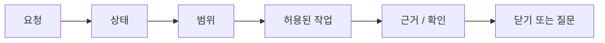

# 사용자 가이드

## 이 문서로 할 수 있는 일

AI와 함께 작업할 때 Harness가 어떻게 쓰이는지 이해하되, 대화가 작업 관리 시스템처럼 무거워지지 않게 하는 방법을 설명합니다.

Harness는 범위, 근거, 확인, 결정, QA, 남은 위험, 종료 상태를 보이게 해줍니다. 그래도 사용자는 평소처럼 말하면 됩니다. Harness가 연결되어 있다면 별도의 시작 문장을 외울 필요가 없습니다. 원하는 일을 평소 말로 설명하면, 에이전트가 작업의 성격을 보고 Harness를 적용할지 판단해야 합니다.

Harness는 제품 파일이 바뀔 수 있거나, 범위가 흔들릴 수 있거나, 사용자 판단이 필요하거나, 근거, 검증, QA, 수락, 남은 위험을 추적해야 하거나, 민감한 범주가 관련될 수 있을 때 보통 알맞습니다. 아주 작은 질문이나 명확한 읽기 전용 조언은 에이전트가 바로 처리할 수 있습니다.

명시적으로 말하고 싶다면 여전히 이렇게 말할 수 있습니다.

```text
이 작업을 Harness 기준으로 진행해.
```

에이전트가 사용자의 요청을 필요한 Harness 절차로 바꿔야 합니다. 사용자가 내부 기록을 직접 조작할 필요는 없습니다.

Harness의 깊은 용어는 실제로 멈춘 이유, 경계, 닫기 조건을 설명할 때만 쓰면 됩니다.

Harness는 단순한 기술 게이트 시스템도, 단순한 계획 체크리스트도 아닙니다. 사용자가 소유하는 제품 판단과 중요한 기술 판단을 돕되 승인, Write Authorization, 검증, Manual QA, 남은 위험, 수락을 서로 분리해 두는 장치입니다.

## 이런 때 읽기

Harness가 연결된 상태에서 AI와 함께 하는 작업 하나가 어떻게 처리되어야 하는지 알고 싶을 때 읽습니다.

## 읽기 전에

[하나의 작업으로 보는 Harness](../learn/harness-in-one-task.md)를 먼저 보면 도움이 되지만, 필수는 아닙니다.

## 핵심 생각

사용자는 평소처럼 말하면 됩니다. 별도의 시작 문장은 필요하지 않습니다. 에이전트가 작업에 필요할 때 그 요청을 알맞은 Harness 흐름으로 바꿔야 합니다.

## 5분 시작 경로

외워야 하는 한 문장은 없습니다. 하고 싶은 일과 알고 있는 경계를 평소 말로 시작합니다.

```text
이메일 로그인 흐름을 추가해. 비밀번호 재설정과 계정 생성은 범위 밖이야.
```

에이전트는 요청이 읽기 전용 조언인지, 작은 direct 작업인지, 추적이 필요한 work인지 판단해야 합니다. 추적이 필요하다면 깊게 들어가기 전에 먼저 세 가지 쉬운 질문에 답해야 합니다.

- 범위가 무엇이고, 범위 밖은 무엇인가?
- 이미 있는 근거나 확인은 무엇이고, 아직 부족한 것은 무엇인가?
- 지금 사용자가 판단해야 할 것이 있는가?

작고 명확한 일은 `direct`로 가볍게 처리할 수 있습니다. 크거나 위험하거나 여러 파일에 걸치거나 요구가 흐린 일은 변경하기 전에 먼저 범위를 잡아야 합니다.

막혔을 때는 이렇게 묻습니다.

```text
지금 무엇 때문에 막혀 있고, 어떤 결정 하나나 확인 하나가 있으면 풀릴까?
```

닫기 직전에는 이렇게 묻습니다.

```text
수락하기 전에 닫기에 영향을 주는 남은 위험을 보여줘.
```

## 에이전트가 먼저 보여줘야 할 것

시작할 때나 중요한 작업을 이어갈 때는 에이전트가 짧은 상태나 Journey Card를 먼저 보여줘야 합니다. 빠르게 훑을 수 있으면서도 행동할 만큼 구체적이어야 합니다. 다음 판단이나 안전한 행동을 정하는 데 영향을 주는 내용만 보여주되, Task, mode, scope, out of bounds, next safe action, 필요한 결정, 막힘 상태, 쓰기 권한, 근거, 검증, Manual QA, 남은 위험, guarantee level, projection 최신성처럼 권한 맥락은 유지해야 합니다.

```text
작업: TASK-123 이메일 로그인 흐름 추가
모드: work
범위: 로그인 폼, 로그인 API 호출, 세션 저장
범위 밖: 비밀번호 재설정, 계정 생성
다음 안전한 행동: 최종 UI 동작을 연결하기 전에 로그인 실패 UX 결정
필요한 결정: 로그인 실패 메시지
가장 먼저 해소할 막힘: 로그인 실패 피드백에 대한 사용자 소유 결정
가장 작은 해소 방법: DEC-014에서 선택지 하나 고르기
추가 막힘: 구현 뒤 근거 수집; UI 문구가 바뀌면 닫기 전 Manual QA
쓰기 권한: 아직 요청하지 않음
근거: 아직 없음; 나중에 로그인 제출과 로그인 실패 처리 근거 필요
검증: 아직 실행하지 않음; 구현 전에는 detached verification을 기대하지 않음
Manual QA: 최종 문구와 레이아웃에 필요할 가능성 있음
남은 위험: 기록 없음
보장 수준: cooperative; 실행 전 차단을 주장하지 않음. changed-path validation이 있으면 범위를 벗어난 쓰기를 실행 뒤에 감지할 수 있음
Projection 최신성: source_state_version v42 기준 current
```

핵심은 다음 안전한 행동과 가장 작은 해소 방법입니다. 가장 먼저 해소할 막힘은 다음 움직임을 누가 소유하는지 말해야 합니다. 제품 판단, 중요한 기술 판단, Approval, QA, 남은 위험을 받아들이는 판단, 최종 수락처럼 사용자가 판단해야 하면 사용자 소유 막힘입니다. 상태 refresh, 근거 수집, check 재실행, `prepare_write` 재시도, 범위 축소처럼 에이전트가 사용자 판단을 바꾸지 않고 처리할 수 있으면 에이전트가 해소 가능한 막힘입니다. 추가 막힘은 가장 먼저 해소할 막힘이 풀린 뒤에도 여전히 의미가 있을 때만 보여줍니다.

상태가 오래됐거나 이상해 보이면 이렇게 말합니다.

```text
Harness 상태 기준으로 현재 상태와 다음 행동을 다시 보여줘.
```

Projection 최신성은 작업 결과가 아니라 읽기용 보기(view)가 최신인지 나타냅니다. `current`는 카드나 보고서가 표시한 state version과 맞는다는 뜻입니다. `stale`, `failed`, `unknown`은 그 읽기용 보기를 믿기 전에 refresh 또는 reconcile이 필요할 수 있다는 뜻입니다.

이것은 오래된 상태(stale state), 오래된 기준선(stale baseline), 오래된 근거(stale evidence)와 다릅니다. 그런 상태는 실제 작업 입력이 바뀌었거나 오래됐거나 주장을 더 이상 뒷받침하지 못한다는 뜻이며, 상태 카드 자체가 current여도 쓰기나 닫기를 막을 수 있습니다. MCP unavailable도 별개입니다. 에이전트가 필요한 Harness/Core 기능에 닿지 못한다면 그 사실을 바로 말해야 하며, 연결이나 기능이 복구되기 전에는 기준 상태 변경, Approval, 결과 수락, 남은 위험을 받아들이는 판단, gate 갱신, projection 복구, 닫기가 처리됐다고 주장하면 안 됩니다.

자주 보게 되는 복구 해석:

- Projection은 stale이지만 Core state가 current인 경우: 읽기용 보기를 refresh 또는 reconcile한 뒤 Core state에서 계속합니다. 오래된 Markdown report를 권한의 출처로 삼지 않습니다.
- MCP unavailable인 경우: 필요한 Harness/Core capability를 사용할 수 있거나 가능한 surface로 옮길 때까지 제품 파일 쓰기와 gate 갱신을 보류하고, Approval, 결과 수락, 남은 위험을 받아들이는 판단, 닫기가 처리됐다고 주장하지 않습니다.
- Managed block을 사람이 직접 편집한 경우: 그 편집을 drift 또는 proposal로 보고, state가 되기 전에 Reconcile로 보냅니다.

상태 카드는 판단에 필요한 맥락과 다릅니다. 에이전트에게 사용자 판단이 필요하면 선택지, 추천안, 불확실성, 결정을 미뤘을 때 계속할 수 있는 일, 관련 근거 또는 설계 기록 ref를 담은 간결한 판단 요청을 별도로 붙여야 합니다.

에이전트가 guard, freeze, careful mode 같은 말을 쓴다면 쉬운 말로 풀어야 합니다. 무엇을 실행 전에 실제로 막을 수 있고, 무엇은 실행 뒤에만 감지할 수 있는지 구분해야 합니다. Cooperative 또는 detective 접점에서 freeze는 범위 보류나 다음 행동을 더 엄격하게 제한하는 상태이지 실행 전 강제 차단이 아닙니다.

## 세 가지 일상 질문

### 범위

범위는 "무엇을 하고, 무엇은 하지 않는가?"에 답합니다.

좋은 범위는 에이전트가 실수로 일을 넓히지 않을 만큼 좁고 분명합니다. 영향을 받는 영역, 중요한 제외 사항, 필요한 파일이나 동작 경계를 말해야 합니다.

범위가 분명해지면 에이전트는 그 안의 일상적인 구현 세부사항을 매번 묻지 않고 판단할 수 있습니다. 예를 들면 기존 helper를 쓸지, private function을 나눌지, focused tests를 추가할지, 합의된 결과에 맞는 보수적인 내부 접근을 고를지 같은 일입니다.

대신 사용자나 다른 코드가 기대하는 약속을 바꾸는 선택에서는 멈춰야 합니다. Public API나 module contract, 보안 또는 개인정보 장단점, UX나 제품 동작, 중요한 의존성 또는 migration 방향, 범위 확장, 알려진 남은 위험을 받아들이는 일이 여기에 해당합니다.

Harness는 이 구분을 설명할 때 네 가지 관련 라벨을 쓸 수 있습니다.

| 라벨 | 쉬운 뜻 |
|---|---|
| Change Unit scope | 범위 안에 있는 작업 영역입니다. 그 자체로 쓰기를 허가하지는 않습니다. |
| Autonomy Boundary | 그 범위 안에서 에이전트가 혼자 행사할 수 있는 판단입니다. 쓰기 권한이 아니며 paths, tools, commands, network, secrets, sensitive categories를 부여하지 않습니다. |
| Approval | 민감한 단계에 대한 허가입니다. 수락, 정확성(correctness), 사용자 소유 판단이 아닙니다. |
| Write Authorization | `prepare_write`가 한 번의 쓰기 시도(write attempt)에 부여한 쓰기 허용입니다. 범위나 Autonomy Boundary를 넓히지 않습니다. |

에이전트가 승인을 요청한다면 무엇을 허용하거나 기록하려는지 분명히 이름 붙여야 합니다. 사용자는 민감한 동작을 허용하는 것일 수도 있고, 범위를 확인하는 것일 수도 있으며, Decision Packet을 해결하거나, 남은 위험을 받아들이거나, 최종 결과를 수락하거나, Write Authorization 상태를 확인하는 것일 수도 있습니다. "승인"은 모든 판단을 뭉뚱그리는 포괄 라벨이나 포괄 위임으로 쓰면 안 됩니다.

자주 쓰는 말:

```text
범위와 질문부터 잡아줘.
범위는 이대로 좋아. 방금 합의한 범위를 넘기지 마.
범위가 커져야 한다면, 먼저 선택지와 영향을 보여줘.
내가 정확히 무엇을 승인하는지 말해줘.
```

Harness는 이런 경계를 활성 Change Unit 안에서 작업을 유지하는 일로 설명할 수 있고, 범위 변경에 사용자 판단이 필요하면 Decision Packet으로 물을 수 있습니다. 사용자가 먼저 그런 용어로 말할 필요는 없습니다.

### 근거

근거는 "이 일이 끝났다고 말할 수 있는 뒷받침이 무엇인가?"에 답합니다.

근거는 에이전트가 "했습니다"라고 말하는 것이 아닙니다. 변경된 경로, 테스트 결과, 로그, 스크린샷, QA 기록, 검증 결과처럼 수용 기준을 뒷받침하는 자료입니다.

큰 근거는 먼저 참조(ref)와 짧은 결과로 보여줘야 합니다. 로그, 스크린샷, diff, trace, Run 세부사항, Eval 세부사항, Manual QA note, artifact는 사용자나 다음 검토자가 내용을 살펴봐야 할 때가 아니면 기본 맥락에 붙여 넣지 않습니다.

Markdown 보고서는 이런 근거를 보여주는 유용한 보기(view)이지, 근거나 상태 기록 그 자체가 아닙니다. 보고서를 편집한다면 사람이 적는 note 또는 proposal 영역을 사용합니다. 생성되었거나 관리되는 보고서 본문을 직접 고친 내용은 게이트 변경이 아니라 drift 또는 reconcile input으로 다뤄져야 합니다.

자주 쓰는 말:

```text
어떤 수용 기준에 근거가 부족한지 보여주고, 어떤 확인을 더 하면 충분한지 제안해줘.
```

### 지금 필요한 판단

지금 필요한 판단은 "안전하게 계속하거나 닫기 전에 사용자가 무엇을 결정해야 하는가?"에 답합니다.

대부분의 판단은 다음 중 하나입니다.

- 사용자가 소유하는 제품 방향이나 제품 장단점 선택
- 비용, 호환성, 보안, migration, interface, 유지보수 영향이 큰 중요한 기술 방향 선택
- 민감한 단계 승인
- Manual QA가 필요한지, 또는 생략을 받아들일 수 있는지 결정
- 알려진 남은 위험을 받아들일지 결정
- 최종 수락이 필요한 작업에서 결과 수락

사용자가 소유하는 제품 판단이나 중요한 기술 판단이 진행을 막고 있으면 에이전트는 Decision Packet을 보여줘야 합니다. 옵션, 장단점, 추천, 불확실성, 미룰 경우의 영향이 있어야 합니다. 이를 막연한 "전부 승인할까요?"로 뭉개면 안 됩니다.

좋은 Decision Packet은 허가서가 아니라 판단을 도와주는 자료처럼 느껴져야 합니다. 실제로 골라야 할 선택을 이름 붙이고, 현실적인 경로를 비교하고, 하나를 추천하고, 결정을 미루면 무엇을 안전하게 계속할 수 있는지 또는 결정 전에는 왜 아무것도 계속하면 안 되는지 말해야 합니다.

예시:

- 제품/UX: 로그인 실패 피드백은 인라인 메시지, 토스트, 모달/레이어 중 하나일 수 있습니다. Decision Packet은 사용자 흐름, 방해 정도, 접근성, 문구 위험을 비교한 뒤 경로를 추천해야 합니다.
- 제품 문구: 로그인 실패 문구는 일반적인 문구, 더 구체적인 문구, hybrid 문구 중 하나일 수 있습니다. Decision Packet은 계정 열거(account enumeration) 위험, 명확성, 지원 부담, 복구 도움 정도, 제품 톤을 비교해야 합니다.
- 제품 감각과 QA: 더 완성도 높은 상호작용은 레이아웃, 접근성 해석, 사용감을 위해 Manual QA가 필요할 수 있고, 더 보수적인 동작은 검증하기 쉽습니다. Decision Packet은 장단점과 QA를 미뤄도 계속할 수 있는 일, 또는 결정 전에는 진행하면 안 되는 이유를 보여줘야 합니다.
- 기술 선택: Auth 처리는 session cookie, JWT, social login 중 하나를 쓸 수 있습니다. Decision Packet은 폐기 가능성, CSRF/XSS 노출, client 호환성, 운영 복잡도, migration 영향, 구현 비용을 분리해서 보여줘야 합니다.
- 기술 선택: 의존성 추가에는 Approval과 Decision Packet이 둘 다 관련될 수 있습니다. Install 또는 dependency 파일 edit을 승인하는 것은 그 dependency를 architecture 방향으로 선택하는 것과 다릅니다.
- 기술/데이터 선택: schema migration은 additive인지, compatibility shim을 쓰는지, breaking path인지 보여줘야 합니다. Decision Packet은 migration evidence, rollback risk, data-backfill risk, test boundary, future maintenance 영향을 이름 붙여야 합니다.
- 기술/interface 선택: public API 또는 module-boundary 변경에는 compatibility 또는 breaking-change Decision Packet이 필요할 수 있습니다. 테스트 통과만으로 caller impact, documentation promise, migration path, release risk가 해결되지는 않습니다.
- 보안 민감 작업: secret 접근, 권한 변경, 데이터 export에 대한 Approval은 그 민감한 단계를 진행해도 되는지만 답합니다. 어떤 데이터를 export할지, 누가 export할 수 있는지, 무엇을 redaction할지, artifact에서 무엇을 생략할지, 어떤 감사 기록이 필요한지는 따로 결정해야 합니다.

## 문장 모음

일상 작업은 명령어가 아니라 대화로 시작합니다. 먼저 평소 쓰는 말로 요청하면 됩니다. Harness 용어는 실제로 멈춘 이유, 경계, 닫기 조건을 정확히 설명해야 할 때 에이전트가 꺼내 쓰는 보조 라벨입니다.

| 이렇게 말해도 됩니다 | 필요할 때 에이전트가 쓸 수 있는 Harness 용어 |
|---|---|
| 이메일 로그인 흐름을 추가해. 비밀번호 재설정은 범위 밖이야. | 작업 성격상 필요한 경우 Harness가 추적하는 작업(work). |
| 상태 보여줘. | Journey Card 또는 현재 Task 상태. |
| 이 작업 이어서 해. Harness 상태부터 확인해. | Harness 상태에서 이어가기. |
| 이어가기 전에 Journey Card부터 보여줘. | 더 진행하기 전 이어가기 상태. |
| 작으면 바로 처리하고, 커지면 추적되는 흐름으로 진행해. | `direct` 또는 `work`로 분류. |
| 범위와 질문부터 잡아줘. | Task 범위, 제품 파일을 쓸 수 있으면 활성 Change Unit. |
| 방금 합의한 범위를 넘기지 마. | Change Unit 경계. |
| 범위가 커져야 한다면, 먼저 선택지와 영향을 보여줘. | 범위나 사용자 소유 판단을 위한 Decision Packet. |
| 실행 전에 실제로 막을 수 있는 것과 실행 뒤에만 감지할 수 있는 것을 나눠서 보여줘. | 보장 수준(guarantee level) 또는 접점 능력(surface capability). |
| 가능하면 독립적으로 확인해줘. | 독립 검증(detached verification). |
| Manual QA가 필요한지 판단해줘. | Manual QA 필요 여부 또는 면제(waiver). |
| 수락하기 전에 남은 위험을 보여줘. | 남은 위험(residual risk)과 닫기에 영향을 주는 위험 상태. |
| 최종 수락이 필요하면 닫기 전에 먼저 요청해. | 닫기 전 최종 수락. |
| 여기서는 별도 최종 수락이 필요 없으니, 관련 막힘이 해소되면 닫아. | 이 작업 경로에서는 최종 수락이 필요 없음. |
| 수락해. 이 작업 닫아. | 막힘이 해소된 뒤 작업 닫기. |

명시하고 싶다면 "이 작업을 Harness 기준으로 진행해"라고 말할 수 있지만, 필수 시작 문장은 아닙니다.

검토 관점을 요청할 때도 먼저 쉬운 말로 말하고, 필요한 경우에만 라벨을 붙이면 됩니다.

```text
선택하기 전에 제품 또는 기술 장단점을 따로 봐줘.
엔지니어링, 디자인, 보안, QA, 릴리스 인계 관점에서 확인해줘.
```

이런 검토 요청을 더 정확히 부를 때는 product-review, eng-review, design-review, security-review, qa-review, release-handoff 같은 라벨을 쓸 수 있습니다.

이 라벨들은 Role Lens, playbook, display 요청을 나타냅니다. 무엇을 볼지 좁히는 신호이지 새 gate가 아니며, 그 자체로 권한, Write Authorization, evidence, verification, Manual QA, Approval, 결과 수락, 남은 위험을 받아들이는 판단, Task 닫기를 만들지 않습니다. Lens가 문제를 찾으면 기존 경로로 연결합니다. Decision Packet, evidence, Eval 또는 verification 필요, Manual QA, Residual Risk, Approval, Change Unit update recommendation, close blocker가 그 경로입니다.

유용한 최종 검토는 보통 두 질문을 분리합니다.

```text
Spec Compliance Review: 현재 scope와 권한 안에서 요청한 것을 만들었는가?
Code Quality / Stewardship Review: 결과가 codebase 안에서 유지보수 가능하고 일관적인가?
```

같은 세션에서 하는 review는 유용한 self-check 또는 stewardship signal이 될 수 있지만 detached verification은 아닙니다.

더 조심해서 진행하고 싶을 때:

```text
방금 합의한 범위를 넘기지 마.
범위가 커져야 한다면, 먼저 선택지와 영향을 보여줘.
열려 있는 결정에 답할 때까지 쓰기는 멈춰.
실행 전에 실제로 막을 수 있는 것과 실행 뒤에만 감지할 수 있는 것을 나눠서 보여줘.
이 변경은 조심해서 진행해. 범위를 좁게 유지하고, 쓰기 전에는 쓰기 권한을 보여주고, 사용자가 소유하는 제품 판단이나 중요한 기술 판단 전에는 물어봐.
```

연결된 접점이 실행 전에 실제로 막을 수 없다면 조심 모드(careful mode)는 더 좁은 작업 태도, 더 분명한 상태 표시, 가능한 경우의 사후 감지를 뜻합니다. 실행 전 강제 차단처럼 설명하면 안 됩니다.

같은 요청을 더 정확히 설명해야 할 때는 Change Unit, Decision Packet, 보장 수준(guarantee level), 독립 검증(detached verification), 남은 위험(residual risk), `prepare_write`, Write Authorization 같은 용어가 등장할 수 있습니다. 이 용어들은 실제 막힘이나 닫기 조건을 설명할 때 쓰는 이름이지, 사용자가 먼저 입력해야 하는 명령어가 아닙니다.

## 기본 흐름

기본 흐름은 짧은 대화처럼 느껴져야 합니다. 사용자는 현재 위치, 다음 안전한 행동, 정말 필요한 결정만 보면 됩니다.



일반적인 흐름:

1. 에이전트가 상태를 확인하거나 요청 정리를 시작합니다.
2. 요청을 `advisor`, `direct`, `work` 중 하나로 분류합니다.
3. 제품 파일을 쓸 수 있는 경우 범위와 활성 Change Unit을 확인합니다.
4. 사용자가 소유하는 제품 판단이나 중요한 기술 판단이 막고 있으면 사용자가 Decision Packet에 답합니다.
5. 제품 파일을 쓰기 전에 쓰기 권한을 확인합니다.
6. 변경이나 조언 뒤에는 필요한 결과와 근거를 기록합니다.
7. 필요하면 닫기 전에 검증, Manual QA, 남은 위험, 최종 수락을 처리합니다.

작은 `direct` 작업은 뒤쪽 확인 중 일부를 건너뛸 수 있습니다. 더 큰 작업은 그런 확인을 숨기지 말고, 필요할 때만 보여줘야 합니다.

`direct` 작업 결과는 작고 부담 없어야 합니다. 무엇을 요청했는지, 범위가 어디까지였는지, 무엇이 바뀌었는지, 무엇을 확인했는지, `work`로 전환됐는지, 닫기에 영향을 주는 위험이나 후속 작업이 있는지만 보여주면 됩니다. 결과에 영향을 주지 않은 모든 gate를 다시 나열할 필요는 없습니다.

## 작업이 막혔을 때

막힘은 "왜 지금 안전하게 계속하거나 닫을 수 없는지"를 구체적으로 설명해야 합니다. 가장 먼저 해소할 막힘, 가장 작은 해소 방법, 나중에도 남을 추가 막힘을 분리해서 보여주고, 사용자 소유 막힘인지 에이전트가 해소 가능한 막힘인지도 구분해야 합니다.

좋은 막힘 표시:

```text
막힘:
- 가장 먼저 해소할 막힘(사용자 소유): 빈 상태 동작이 아직 정해지지 않았습니다.
- 가장 작은 해소 방법: DEC-021에서 빈 상태 동작을 선택합니다.
- 추가 막힘: 동작을 고른 뒤 AC-02 근거는 에이전트가 수집할 수 있음; 바뀐 온보딩 문구는 닫기 전 사용자 소유 Manual QA가 필요함.

다음 안전한 행동: DEC-021에 답하거나, 빈 상태를 피하는 더 작은 Change Unit을 에이전트에게 제안하게 합니다.
```

자주 쓰는 말:

```text
지금 무엇 때문에 막혀 있어?
어떤 결정 하나나 확인 하나가 있으면 풀릴까?
가장 작은 안전한 다음 행동을 보여줘.
그 결정은 미루고 더 작은 Change Unit을 제안해줘.
```

## 결정, 승인, QA, 수락, 남은 위험

이 단어들은 서로 다른 질문에 답합니다. 닫기 직전에는 같은 artifact나 같은 대화에 여러 항목이 함께 나오더라도 서로 섞지 않아야 합니다.

| 항목 | 쉬운 역할 | 대신 쓰면 안 되는 것 |
|---|---|---|
| 근거 | 기준이나 결과가 충족됐다는 주장을 뒷받침합니다. | 에이전트의 "완료" 말, 보고서 문장, 최종 수락. |
| 검증 | 적절한 검토 경계에서 정확성(correctness)을 확인합니다. 독립 검증(detached verification)에는 독립성이 필요합니다. | 같은 세션의 자체 검토, 테스트 통과만 있는 상태, Manual QA. |
| Manual QA | UX, workflow, copy, accessibility 해석, 시각 결과, product feel처럼 사람이 봐야 하는 품질을 기록합니다. | 자동 테스트, browser smoke, 검증, 수락. |
| 수락 | Task가 요구할 때 사용자가 결과를 받아들인다는 판단을 기록합니다. | 정확성 증명, QA, 검증, 승인. |
| 남은 위험 | 알려진 불확실성, 한계, 확인하지 못한 조건, 장단점을 이름 붙입니다. | 근거, 검증, QA, 수락. |
| Decision | 사용자 소유 제품 방향, 중요한 기술 방향, 면제(waiver), 닫기 관련 선택을 기록합니다. | 실제 장단점에 답하지 않는 넓은 Approval이나 채팅 동의. |
| Approval | 이름 붙은 민감한 행동을 진행해도 된다는 허가입니다. | 수락, 정확성, 근거, 검증, QA, 남은 위험을 받아들인다는 판단. |

승인은 수락이 아닙니다. 테스트를 통과했다고 Manual QA가 끝난 것도 아닙니다. 같은 세션의 자체 검토는 유용한 self-check일 수 있지만 독립 검증(detached verification)은 아닙니다. 결과를 수락해도 그 자체가 정확성을 증명하지 않습니다. 남은 위험을 받아들이는 것도 증명이 아니라, 알려진 불확실성이 이 Task에서 보였고 이 Task 안에서 받아들여졌다는 뜻입니다. 최종 수락이 필요한 경우에는 닫기에 영향을 주는 남은 위험이 표시되었거나 알려진 close-relevant risk가 없다고 보고된 뒤에 따로 요청되어야 합니다.

의존성 추가, 인증이나 권한 변경, 데이터 모델 변경, 공개 API 변경, 파괴적 쓰기, secret 접근, 운영 설정 변경은 승인이 필요할 수 있습니다. Approval은 민감한 단계를 진행해도 되는지만 답합니다. 의존성, migration, interface, module boundary, 제품, 중요한 기술, QA, 위험 선택 자체에는 별도의 Decision Packet이 여전히 필요할 수 있습니다.

Sensitive category가 나타나면 좋은 prompt는 먼저 평범한 말로 설명해야 합니다. 어떤 side effect나 외부 영향이 일어나는지, 어떤 path, system, service, secret, data가 관련되는지, Harness가 이를 실행 전에 막을 수 있는지 아니면 실행 뒤에만 문제를 감지할 수 있는지, 어떤 evidence를 기록할지, 무엇을 redaction 또는 omission할지를 말합니다. Category label은 `secret_access`나 `data_export`처럼 괄호 안에 덧붙이면 충분합니다. 정확한 category 예시는 [MCP API와 스키마](../reference/mcp-api-and-schemas.md#sensitive-categories)에 있고, 정확한 write authority 동작은 [커널 참조](../reference/kernel.md#prepare_write)에 있습니다.

자주 섞이는 "승인" 예시:

- Dependency install을 승인하는 것은 그 dependency를 architecture 방향으로 선택하는 것과 다릅니다.
- Secret access를 승인하는 것은 secret 값을 artifacts, projections, exports, logs, screenshots, summaries에 드러내도 된다는 뜻이 아닙니다.
- Auth 또는 system-file access를 승인하는 것은 session auth, JWT, social login, role design, lockout behavior, user notice를 선택하는 것이 아닙니다.
- Public API 변경을 결정하는 것은 deploy, merge, 추가 쓰기를 허가하는 것이 아닙니다.
- 최종 수락(Final acceptance)은 해당 Task 경로가 요구할 때 결과를 수락한다는 뜻입니다. 추가 edit를 위한 Write Authorization이 아닙니다.

에이전트가 QA 또는 검증 면제(verification waiver)를 요청한다면 어떤 기존 기록 방식을 사용할지 이름 붙여야 합니다. QA waiver는 Manual QA 상태와 `qa_gate=waived`로 기록하고, product/user risk 또는 policy-required judgment가 있으면 QA waiver Decision Packet을 참조해야 합니다. Verification waiver는 `verification_gate=waived_by_user`로 기록하고, 사용자 소유 판단이 필요하면 관련 Decision Packet을 참조해야 합니다. 그 판단 요청은 무엇을 확인하지 않는지, 사용자가 어떤 위험을 받아들이는지, 어떤 후속 작업이 남는지, 어떤 refs가 관련되는지, 닫기에 어떤 영향을 주는지 말해야 합니다. 닫기에 영향을 주는 waiver나 남은 위험을 받아들이는 판단이 있다면 가벼운 채팅 문장만으로 waiver가 기록된 것처럼 다루면 안 됩니다. 남은 위험을 안고 닫자고 요청한다면 먼저 남은 한계를 보여준 뒤, 그 위험을 이 Task에서 받아들일지 물어야 합니다.

적용 예시:

- Direct 문서 또는 copy 수정: 변경 경로, diff 또는 patch summary, self-check가 주장을 뒷받침할 수 있습니다. 이를 독립 검증(detached verification)이라고 부르면 안 되며, 변경된 화면이나 표시 영역이 사람의 확인을 필요로 하지 않는 한 Manual QA가 필요한 것은 아닙니다.
- UI/UX 작업: 테스트와 browser smoke는 렌더링이나 동작 주장을 뒷받침할 수 있습니다. 레이아웃, 상호작용 사용감, 문구, 접근성 해석은 여전히 Manual QA가 확인하는 영역입니다. QA waiver는 생략한 대상, 받아들이는 위험, 후속 작업, 관련 refs, 닫기 영향을 이름 붙여야 합니다.
- Auth 또는 security 작업: Approval은 secret 접근, 권한 변경, auth 파일 쓰기를 허용할 수 있습니다. 하지만 role, redaction, audit trail, session model, lockout behavior, user notice를 결정한다면 security 또는 product 선택에는 여전히 Decision Packet이 필요합니다.
- Public API 작업: 테스트 통과는 동작을 뒷받침하지만 compatibility, caller impact, migration path, documentation promise에는 Decision Packet과 독립 검증(independent verification)이 필요할 수 있습니다.
- 위험을 받아들이고 닫기: 에이전트는 존재하는 근거, 빠졌거나 면제된 verification 또는 QA, 남은 한계, 받아들인 위험, 후속 작업을 보여줘야 합니다. 위험을 받아들이고 닫는 것은 detached verified로 닫는 것과 다릅니다.

## 닫기 체크리스트

닫기 전에 에이전트는 다음을 쉬운 말로 분명히 해야 합니다.

`work` Task의 닫기 요약은 적용된 변경 범위, 근거, 검증, Manual QA, 남은 위험, 수락, close reason을 해당되는 만큼 보여줘야 합니다. 어떤 확인이 면제되었거나, 아직 대기 중이거나, 필요하지 않았다면 그대로 말해야 합니다. 닫기에 영향을 주는 남은 위험을 일반적인 "완료" 문장 속에 묻으면 안 됩니다.

- 결과가 합의한 범위와 맞습니다.
- 필요한 근거가 있거나, 이 작업에는 근거가 필요하지 않습니다.
- 검증이 이 작업 경로에서 기대되지 않거나, 완료되었거나, 기록된 위험과 함께 명시적으로 면제되었습니다.
- Manual QA가 필요 없거나, 완료되었거나, 타당하게 면제되었습니다.
- 알려진 닫기에 영향을 주는 남은 위험이 표시되었거나, 에이전트가 알려진 close-relevant residual risk가 없다고 보고했습니다.
- 최종 수락이 필요한 경우 승인이 아니라 별도 수락으로 요청되었습니다.

닫을 때 쓸 수 있는 말:

```text
닫기 체크리스트를 보여줘.
표시된 남은 위험을 받아들일게. 남은 위험을 받아들이고 닫아.
수락해. 이 작업 닫아.
아직 수락하지 않아. 닫기 전에 UX를 다시 작업해.
```

## 다음에 볼 문서

에이전트가 세션을 어떻게 진행해야 하는지는 [에이전트 세션 흐름](agent-session-flow.md)을 봅니다.

Harness를 쓰기 전에 전체 그림을 보고 싶다면 [하나의 작업으로 보는 Harness](../learn/harness-in-one-task.md)와 [핵심 개념](../learn/concepts.md)을 봅니다.

자세한 커넥터 계약과 능력 프로필은 [Agent 통합 참조](../reference/agent-integration.md)가 담당합니다. 접점별 설정은 [Surface Cookbook](../reference/surface-cookbook.md)을 봅니다.
